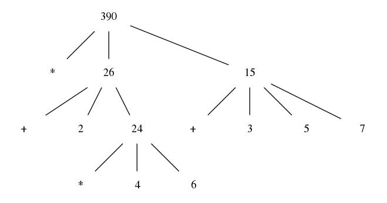

# Table of Contents

1.  [noweb + common](#orge74d3b4)
    1.  [Setting chibi arguments. DANGEROUS](#org16f5e8c):dangerous:elisp:
    2.  [Some common code blocks](#org7e281a5)
2.  [SICP <code>[15%]</code>](#org4125c3d)
    1.  [Chapter 1: Building abstractions with procedures <code>[57/61]</code>](#orga37bbb3)
        1.  [Snippet](#orgd1582d1)
        2.  [Thought](#org1cac8d7)
        3.  [Figure 1.1 Tree representation, showing the value of each subcombination](#org90c1212)
        4.  [Snippet](#orge8b7be8)
        5.  [Exercise 1.1 Interpreter result](#orgcb7208c)
        6.  [Exercise 1.2 Prefix form](#org0099a56)
        7.  [Exercise 1.3 Sum of squares](#org02162d4)
        8.  [Exercise 1.4 Compound expressions](#orgc0380f1)
        9.  [Exercise 1.5 Ben's test](#orge748425)
        10. [Exercise 1.6 If is a special form](#org48e9bb0)
        11. [Exercise 1.7 Good enough?](#orgf86ac4d)
        12. [Exercise 1.8 Newton's method](#orgf0d7742)
        13. [Figure 1.2 Procedural decomposition of the sqrt program](#org26e84fe)
        14. [Figure 1.3 A linear recursive process for computing \(6!\).](#orgf4ce9fe)
        15. [Figure 1.4 A linear iterative process for computing \(6!\).](#orgb7ed152)
        16. [Exercise 1.9 Iterative or recursive?](#org4655c16):macro:er_macro_transformer:chicken:
        17. [Exercise 1.10 Ackermann's function](#orgc9283c7)
        18. [Figure 1.5 The tree-recursive process generated in computing (fib 5)](#orgb0b3290)
        19. [Exercise 1.11 Recursive vs iterative](#org2153d3d)
        20. [Exercise 1.12 Recursive Pascal's triangle](#org08852ff)
        21. [Exercise 1.13 Fibonacci](#org0f3d24f)
        22. [Exercise 1.14 count-change](#org82a9d4d):macro:er_macro_transformer:
        23. [I found a bug in ob-scheme while doing this Exercise.](#org1da26b6)
        24. [Exercise 1.15 sine](#org564630e):macro:er_macro_transformer:
        25. [Exercise 1.16 Iterative exponentiation](#org2116169)
        26. [Exercise 1.17 Fast multiplication](#org0c87108)
        27. [Exercise 1.18 Iterative multiplication](#org6a26fdb)
        28. [Exercise 1.19 Logarithmic Fibonacci](#orgd17fa61)
        29. [**Interjection** ir-macro-transformer.](#org34ce110)
        30. [Exercise 1.20 GCD applicative vs normal](#org487532a):er_macro_transformer:macro:
        31. [Exercise 1.21 smallest-divisor](#orgf7afbd6)
        32. [Exercise 1.22 timed-prime-test](#orgcbe8162)
        33. [Exercise 1.23 (next test-divisor)](#org786f083)
        34. [Exercise 1.24 Fermat method](#org7edef46)
        35. [Exercise 1.25 expmod](#org81ab26a)
        36. [Exercise 1.26 square vs mul](#org41a8bdd)
        37. [Exercise 1.27 Carmichael numbers](#orgc2cedbe)
        38. [Exercise 1.28 Miller-Rabin](#org8b9add9)
        39. [Exercise 1.29 Simpson's integral](#org07ce3e7)
        40. [Exercise 1.30 Iterative sum](#orgb9c2407)
        41. [Exercise 1.31 Product](#org99bb3bc)
        42. [Exercise 1.32 Accumulator](#org63546c7)
        43. [Exercise 1.33 filtered-accumulate](#org01fb3b0)
        44. [Exercise 1.34 lambda](#org38d48e0)
        45. [Exercise 1.35 fixed-point](#orgb57ba4b)
        46. [Exercise 1.36 fixed-point-with-dampening](#org32682c3)
        47. [Exercise 1.37 cont-frac](#org1669aa7)
        48. [Exercise 1.38 euler constant](#org8fc8fec)
        49. [Exercise 1.39 tan-cf](#orgac78cbd)
        50. [Exercise 1.40 newtons-method](#orgc60438e)
        51. [Exercise 1.41 double-double](#org302fb3d)
        52. [Exercise 1.42 compose](#orgfe22e17)
        53. [Exercise 1.43 repeated](#orgceb45d3)
        54. [Exercise 1.44 smoothing](#org88c9049)
        55. [Exercise 1.45 nth-root](#orgbf9b0ac)
        56. [Exercise 1.46 iterative-improve](#org356685b)
    2.  [Chapter 2: Building abstractions with Data <code>[0/97]</code>](#org8b0a5f0)
        1.  [Exercise 2.1](#orgf454698)
        2.  [Exercise 2.2](#orgbd5284c)
        3.  [Exercise 2.3](#org9b52d0f)
        4.  [Exercise 2.4](#orgf4108a2)
        5.  [Exercise 2.5](#orga1e56b8)
        6.  [Exercise 2.6](#org341f160)
        7.  [Exercise 2.7](#org4b9cd3e)
        8.  [Exercise 2.8](#org28c7872)
        9.  [Exercise 2.9](#org8e10a64)
        10. [Exercise 2.10](#orgba0f724)
        11. [Exercise 2.11](#org4a55239)
        12. [Exercise 2.12](#orgf87b587)
        13. [Exercise 2.13](#org01e68e4)
        14. [Exercise 2.14](#orgb2057f8)
        15. [Exercise 2.15](#org9866fd1)
        16. [Exercise 2.16](#org4831e94)
        17. [Exercise 2.17](#org9431462)
        18. [Exercise 2.18](#org48060c1)
        19. [Exercise 2.19](#org3c9781b)
        20. [Exercise 2.20](#org55fccec)
        21. [Exercise 2.21](#org1205ee7)
        22. [Exercise 2.22](#orgff0256e)
        23. [Exercise 2.23](#orgf03a231)
        24. [Exercise 2.24](#org2f53637)
        25. [Exercise 2.25](#org89bd74c)
        26. [Exercise 2.26](#org0a5c85b)
        27. [Exercise 2.27](#org54a10d8)
        28. [Exercise 2.28](#org9c5e344)
        29. [Exercise 2.29](#org7bbb351)
        30. [Exercise 2.30](#orgc9c186a)
        31. [Exercise 2.31](#org5e8df78)
        32. [Exercise 2.32](#orgad61017)
        33. [Exercise 2.33](#org857b78e)
        34. [Exercise 2.34](#orgab28168)
        35. [Exercise 2.35](#orgbb948ee)
        36. [Exercise 2.36](#org3d99e0a)
        37. [Exercise 2.37](#org3429df0)
        38. [Exercise 2.38](#orgc339bdf)
        39. [Exercise 2.39](#org1460f95)
        40. [Exercise 2.40](#org57d4bfd)
        41. [Exercise 2.41](#org9eb8207)
        42. [Exercise 2.42](#orge9ae403)
        43. [Exercise 2.43](#org971054c)
        44. [Exercise 2.44](#org1ca89d5)
        45. [Exercise 2.45](#orgf223071)
        46. [Exercise 2.46](#orgf24ce6e)
        47. [Exercise 2.47](#org3475b8c)
        48. [Exercise 2.48](#orgcf3ee2e)
        49. [Exercise 2.49](#org5184374)
        50. [Exercise 2.50](#org1665a8f)
        51. [Exercise 2.51](#org2cde812)
        52. [Exercise 2.52](#org32e096b)
        53. [Exercise 2.53](#org65d5b95)
        54. [Exercise 2.54](#org4c7b061)
        55. [Exercise 2.55](#org6a225e2)
        56. [Exercise 2.56](#orgc482994)
        57. [Exercise 2.57](#orgae8bfb0)
        58. [Exercise 2.58](#orgd551b04)
        59. [Exercise 2.59](#orgb8bc054)
        60. [Exercise 2.60](#org91d67cb)
        61. [Exercise 2.61](#org3eef670)
        62. [Exercise 2.62](#org616950a)
        63. [Exercise 2.63](#orgb29b50e)
        64. [Exercise 2.64](#org19575d7)
        65. [Exercise 2.65](#orgaa458e3)
        66. [Exercise 2.66](#orgcb17181)
        67. [Exercise 2.67](#org21e094e)
        68. [Exercise 2.68](#org96aaf53)
        69. [Exercise 2.69](#orgf5bfb1e)
        70. [Exercise 2.70](#org942b1e3)
        71. [Exercise 2.71](#org1571de0)
        72. [Exercise 2.72](#orgd358268)
        73. [Exercise 2.73](#orgec7dece)
        74. [Exercise 2.74](#orgc54db85)
        75. [Exercise 2.75](#org2d42be6)
        76. [Exercise 2.76](#org16c7a2b)
        77. [Exercise 2.77](#orgac6ddf9)
        78. [Exercise 2.78](#orgfe14112)
        79. [Exercise 2.79](#org802465d)
        80. [Exercise 2.80](#org6664317)
        81. [Exercise 2.81](#org364b009)
        82. [Exercise 2.82](#orga8d0609)
        83. [Exercise 2.83](#orga35ef28)
        84. [Exercise 2.84](#orgf5b6c00)
        85. [Exercise 2.85](#org83c87cb)
        86. [Exercise 2.86](#orgf4e9b60)
        87. [Exercise 2.87](#org0714d53)
        88. [Exercise 2.88](#org49dfbf6)
        89. [Exercise 2.89](#orgb519bbf)
        90. [Exercise 2.90](#org6119929)
        91. [Exercise 2.91](#orge290366)
        92. [Exercise 2.92](#org5b108d9)
        93. [Exercise 2.93](#orgdb99a1b)
        94. [Exercise 2.94](#orgf665db2)
        95. [Exercise 2.95](#org8ce961c)
        96. [Exercise 2.96](#orgdd73679)
        97. [Exercise 2.97](#orga1e1dda)
    3.  [Chapter 3: Modularity, Objects and State <code>[0/82]</code>](#org0132c8b)
        1.  [Exercise 3.1](#org056a93a)
        2.  [Exercise 3.2](#org514820b)
        3.  [Exercise 3.3](#orgf24cc17)
        4.  [Exercise 3.4](#org172bbe3)
        5.  [Exercise 3.5](#orgdbe7235)
        6.  [Exercise 3.6](#orgadff050)
        7.  [Exercise 3.7](#org4944fd6)
        8.  [Exercise 3.8](#org790d94d)
        9.  [Exercise 3.9](#orgf8ebc7d)
        10. [Exercise 3.10](#org2a0b889)
        11. [Exercise 3.11](#org8938b52)
        12. [Exercise 3.12](#org9f2a291)
        13. [Exercise 3.13](#org3924765)
        14. [Exercise 3.14](#org60b5b15)
        15. [Exercise 3.15](#org9170b0d)
        16. [Exercise 3.16](#orgf936463)
        17. [Exercise 3.17](#org6c564f2)
        18. [Exercise 3.18](#org779bfce)
        19. [Exercise 3.19](#org1c56288)
        20. [Exercise 3.20](#orgd9919dd)
        21. [Exercise 3.21](#orgc9d8bbc)
        22. [Exercise 3.22](#org058eb37)
        23. [Exercise 3.23](#org309520c)
        24. [Exercise 3.24](#org4f77e1a)
        25. [Exercise 3.25](#org08b028a)
        26. [Exercise 3.26](#org1aa35d1)
        27. [Exercise 3.27](#org01c52ba)
        28. [Exercise 3.28](#orgaada9ce)
        29. [Exercise 3.29](#org38bb49d)
        30. [Exercise 3.30](#org712dfdf)
        31. [Exercise 3.31](#orga1f9216)
        32. [Exercise 3.32](#org7aa2284)
        33. [Exercise 3.33](#orgd0ba589)
        34. [Exercise 3.34](#org8ae7b08)
        35. [Exercise 3.35](#orgf9d1690)
        36. [Exercise 3.36](#org3e7d996)
        37. [Exercise 3.37](#orgf52bfa1)
        38. [Exercise 3.38](#orgc264e3d)
        39. [Exercise 3.39](#org0a35db4)
        40. [Exercise 3.40](#orga5edb42)
        41. [Exercise 3.41](#org4b59687)
        42. [Exercise 3.42](#org90773f2)
        43. [Exercise 3.43](#org2ccb252)
        44. [Exercise 3.44](#org9f23bdb)
        45. [Exercise 3.45](#orga5074e7)
        46. [Exercise 3.46](#org45856cf)
        47. [Exercise 3.47](#org744e789)
        48. [Exercise 3.48](#org074352d)
        49. [Exercise 3.49](#orgacdd10a)
        50. [Exercise 3.50](#orgd040901)
        51. [Exercise 3.51](#org4b70498)
        52. [Exercise 3.52](#org02f2764)
        53. [Exercise 3.53](#orgf3d5f40)
        54. [Exercise 3.54](#orgc6d19ea)
        55. [Exercise 3.55](#orgd4651af)
        56. [Exercise 3.56](#orga91a712)
        57. [Exercise 3.57](#org354d175)
        58. [Exercise 3.58](#orgc2fb8c3)
        59. [Exercise 3.59](#org262fa91)
        60. [Exercise 3.60](#org0f2e054)
        61. [Exercise 3.61](#org1948d9a)
        62. [Exercise 3.62](#orgdad82c6)
        63. [Exercise 3.63](#org35c6a50)
        64. [Exercise 3.64](#org8151a70)
        65. [Exercise 3.65](#org5e89537)
        66. [Exercise 3.66](#org1e1d1d3)
        67. [Exercise 3.67](#orgf606ca9)
        68. [Exercise 3.68](#org1493763)
        69. [Exercise 3.69](#org3334213)
        70. [Exercise 3.70](#org055cbcd)
        71. [Exercise 3.71](#org0d510dd)
        72. [Exercise 3.72](#org80f5ea3)
        73. [Exercise 3.73](#orgfd1ddc9)
        74. [Exercise 3.74](#org0306782)
        75. [Exercise 3.75](#org9a24d39)
        76. [Exercise 3.76](#org143320d)
        77. [Exercise 3.77](#orgf8dec26)
        78. [Exercise 3.78](#org9445656)
        79. [Exercise 3.79](#orga0667ad)
        80. [Exercise 3.80](#orge78f084)
        81. [Exercise 3.81](#org476071e)
        82. [Exercise 3.82](#org3c01be6)
    4.  [Chapter 4: Metalinguistic Abstraction <code>[0/79]</code>](#org7e95b7a)
        1.  [Exercise 4.1](#orgb3594e1)
        2.  [Exercise 4.2](#org739acc6)
        3.  [Exercise 4.3](#orgbdaa009)
        4.  [Exercise 4.4](#org02c8605)
        5.  [Exercise 4.5](#orgd44551b)
        6.  [Exercise 4.6](#orgf93bebb)
        7.  [Exercise 4.7](#org2edcb6f)
        8.  [Exercise 4.8](#org7ed102a)
        9.  [Exercise 4.9](#org9479290)
        10. [Exercise 4.10](#org7c1af1a)
        11. [Exercise 4.11](#orgd6ac292)
        12. [Exercise 4.12](#org149e47c)
        13. [Exercise 4.13](#orga76cb02)
        14. [Exercise 4.14](#org87a9cc8)
        15. [Exercise 4.15](#orgdfb03f1)
        16. [Exercise 4.16](#orgae23259)
        17. [Exercise 4.17](#orgb068b51)
        18. [Exercise 4.18](#org53fe529)
        19. [Exercise 4.19](#org3a8bb0b)
        20. [Exercise 4.20](#org86e3f40)
        21. [Exercise 4.21](#org530b7f8)
        22. [Exercise 4.22](#orgc30f6b8)
        23. [Exercise 4.23](#orge112f84)
        24. [Exercise 4.24](#org11c7d86)
        25. [Exercise 4.25](#orge4d89b3)
        26. [Exercise 4.26](#org9d0525a)
        27. [Exercise 4.27](#orgc8c981a)
        28. [Exercise 4.28](#orgad894c7)
        29. [Exercise 4.29](#org2b02f70)
        30. [Exercise 4.30](#org1365348)
        31. [Exercise 4.31](#orga4a5bcb)
        32. [Exercise 4.32](#org075685f)
        33. [Exercise 4.33](#orgf61eac9)
        34. [Exercise 4.34](#orgd8767fa)
        35. [Exercise 4.35](#orgab61800)
        36. [Exercise 4.36](#org39be274)
        37. [Exercise 4.37](#org07c4abc)
        38. [Exercise 4.38](#org231189f)
        39. [Exercise 4.39](#orgeba4f96)
        40. [Exercise 4.40](#orgd1324e4)
        41. [Exercise 4.41](#orgd7ee683)
        42. [Exercise 4.42](#orgf4a8e62)
        43. [Exercise 4.43](#org7fa65cc)
        44. [Exercise 4.44](#org45ae46e)
        45. [Exercise 4.45](#org2815b21)
        46. [Exercise 4.46](#org081f48f)
        47. [Exercise 4.47](#org5b3684c)
        48. [Exercise 4.48](#orge1f495f)
        49. [Exercise 4.49](#org5829f5c)
        50. [Exercise 4.50](#org4cc5453)
        51. [Exercise 4.51](#orgb6281d5)
        52. [Exercise 4.52](#org5ca0604)
        53. [Exercise 4.53](#org09f2221)
        54. [Exercise 4.54](#orgf3a17d1)
        55. [Exercise 4.55](#org020cfbc)
        56. [Exercise 4.56](#orge205bb8)
        57. [Exercise 4.57](#orgad9edf5)
        58. [Exercise 4.58](#org7f86191)
        59. [Exercise 4.59](#org7a7d389)
        60. [Exercise 4.60](#org7970e9d)
        61. [Exercise 4.61](#org9148906)
        62. [Exercise 4.62](#org9a5313c)
        63. [Exercise 4.63](#org68db2db)
        64. [Exercise 4.64](#orgab90f51)
        65. [Exercise 4.65](#org304627b)
        66. [Exercise 4.66](#org049cbc3)
        67. [Exercise 4.67](#org3ec495d)
        68. [Exercise 4.68](#orgc97eb1a)
        69. [Exercise 4.69](#org415c5fb)
        70. [Exercise 4.70](#orgcccf2f1)
        71. [Exercise 4.71](#orgc566afd)
        72. [Exercise 4.72](#org928229f)
        73. [Exercise 4.73](#orgb56e2c4)
        74. [Exercise 4.74](#org3edcab9)
        75. [Exercise 4.75](#orga72c30b)
        76. [Exercise 4.76](#org47551fe)
        77. [Exercise 4.77](#orgec0a127)
        78. [Exercise 4.78](#orgde93f4b)
        79. [Exercise 4.79](#org7ca1684)
    5.  [Chapter 5: Computing with Register Machines <code>[0/52]</code>](#orga98593e)
        1.  [Exercise 5.1](#orgc6149bb)
        2.  [Exercise 5.2](#org434d9ee)
        3.  [Exercise 5.3](#org8156ab1)
        4.  [Exercise 5.4](#org8703ab4)
        5.  [Exercise 5.5](#orga2c9943)
        6.  [Exercise 5.6](#org07224fa)
        7.  [Exercise 5.7](#org618c603)
        8.  [Exercise 5.8](#orgb99f147)
        9.  [Exercise 5.9](#org0da0781)
        10. [Exercise 5.10](#org912d517)
        11. [Exercise 5.11](#org889600f)
        12. [Exercise 5.12](#orgd290097)
        13. [Exercise 5.13](#orgad72a80)
        14. [Exercise 5.14](#org09c709a)
        15. [Exercise 5.15](#org5b423d5)
        16. [Exercise 5.16](#org16b6a90)
        17. [Exercise 5.17](#org9865b22)
        18. [Exercise 5.18](#org837944e)
        19. [Exercise 5.19](#orgce930b5)
        20. [Exercise 5.20](#orge8ac753)
        21. [Exercise 5.21](#orgcb2530c)
        22. [Exercise 5.22](#org4d0dca4)
        23. [Exercise 5.23](#org9ce383d)
        24. [Exercise 5.24](#orgd147cdf)
        25. [Exercise 5.25](#orgf18e5b9)
        26. [Exercise 5.26](#org259b61f)
        27. [Exercise 5.27](#org90f64a9)
        28. [Exercise 5.28](#org17983c9)
        29. [Exercise 5.29](#org5de8ce3)
        30. [Exercise 5.30](#org86ac727)
        31. [Exercise 5.31](#org4c9367d)
        32. [Exercise 5.32](#org72a02fe)
        33. [Exercise 5.33](#orge467be1)
        34. [Exercise 5.34](#org2da1be7)
        35. [Exercise 5.35](#org4cb6c26)
        36. [Exercise 5.36](#orga95eccb)
        37. [Exercise 5.37](#orgaf8b104)
        38. [Exercise 5.38](#orge2f1862)
        39. [Exercise 5.39](#orgcfa1dc2)
        40. [Exercise 5.40](#org9faeef7)
        41. [Exercise 5.41](#org5734cc7)
        42. [Exercise 5.42](#org632b5a7)
        43. [Exercise 5.43](#orga47811d)
        44. [Exercise 5.44](#orgbb8119e)
        45. [Exercise 5.45](#org0569f69)
        46. [Exercise 5.46](#org4589b16)
        47. [Exercise 5.47](#org92b471d)
        48. [Exercise 5.48](#org042ec60)
        49. [Exercise 5.49](#orgebe0b44)
        50. [Exercise 5.50](#orga014400)
        51. [Exercise 5.51](#orgbedb236)
        52. [Exercise 5.52](#org5ca34ba)

# noweb + common

## Setting chibi arguments. DANGEROUS     :dangerous:elisp:

    (setq geiser-chibi-extra-command-line-parameters
       '("-m" "chibi" "-m" "chibi show" "-m" "chibi show pretty"
         "-m" "chibi ast" "-m" "chibi time" "-m" "srfi 27"))

## Some common code blocks

# SICP <code>[15%]</code>

## TODO Chapter 1: Building abstractions with procedures <code>[57/61]</code>

### Snippet

    (* (+ 2 (* 4 6))
       (+ 3 5 7))

### Thought

Tree accumulation is the process of computing a thing by traversing a tree.

### DONE Figure 1.1 Tree representation, showing the value of each subcombination

For the sake of pedagogical clarity, I have formatted it as a picture.

;

### Snippet

\#+name square

    (define (square x) (* x x))
    (define (sum-of-squares x y)
      (+ (square x) (square y)))
    (sum-of-squares 3 4)

### DONE Exercise 1.1 Interpreter result

    (define (disp sexp)
      (display sexp)
      (newline))
    (disp 10)
    (disp (+ 2 3 4))
    (disp (- 9 1))
    (disp (/ 6 2))
    (disp (+ (* 2 4) (- 4 6)))
    (define a 3)
    (define b (+ a 1))
    (disp (+ a b (* a b)))
    (disp (= a b))
    (disp
     (if (and (> b a) (< b (* a b )))
         b
         a))
    (disp (cond ((= a 4) 6)
         ((= b 4) (+ 6 7 a))
         (else 25)))
    (disp (+ 2 (if (< b a) b a)))
    (disp (* (cond ((> a b) a)
    	    ((< a b) b)
    	    (else -1)) 
    	 (+ a 1)))

### DONE Exercise 1.2 Prefix form

    (/ (+ 5 4 (- 2 (- 3 (+ 6 (/ 4 5))))) (* 3 (- 6 2) (- 2 7)))

### DONE Exercise 1.3 Sum of squares

    (define (sum-of-squares x y)
      (+ (square x) (square y)))
    (import (srfi 95))
    (define (sum-of-two-max a b c)
      (let ((num_list (sort (list a b c) (lambda (a b) (if (> a b) a b)))))
       (sum-of-squares (car num_list) (cadr num_list))))
    (sum-of-two-max 1 2 3)

### DONE Exercise 1.4 Compound expressions

    (define (a-plus-abs-b a b)
      ((if (> b 0) + -) a b))
    (disp (a-plus-abs-b  3 4))
    (disp (a-plus-abs-b  3 -4))

### DONE Exercise 1.5 Ben's test

    (define (p) (p))
    (define (test x y)
      (if (= x 0) 0 y))
    (test 0 (p))

On my interpreter this code goes into an infinite recursion, which
makes sense, I guess, since the second argument to (test) is evaluated
before executing (test). However, if we only substitute *p* into the
application of test and try to traverse the tree depth-first, this
code should be able to terminate successfully?

### DONE Exercise 1.6 If is a special form

The problem with this Alyssa's (new-if) is that both arguments would
be computed, so this (new-if) would be either very inefficient or even
not working at all in the case when one of the arguments is
infeasible.
Consider:

    (import (chibi ast))
    (import (chibi show))
     (define (disp sexp)
       (display sexp)
       (newline))
    (define (new-if predicate then-clause else-clause)
      (cond (predicate then-clause)
    	(else else-clause)))
    (define a 1)
    (define b 0)
    (disp (if (not (= b 0)) (/ a b) a))
    (new-if (not (= b 0)) (/ a b) a)

However, this issue can be solved using scheme macros.

    (import (chibi ast))
    (import (chibi show))
     (define (disp sexp)
       (display sexp)
       (newline))
    (define-syntax new-if
      (syntax-rules ()
        ( (new-if predicate then-clause else-clause)
          (cond (predicate then-clause)
    	    (else else-clause))
        )
      )
    )
    (define a 1)
    (define b 0)
    (disp (if (not (= b 0)) (/ a b) a))
    (disp (new-if (not (= b 0)) (/ a b) a))

The code above works as expected, because the macro does not evaluate
its arguments, and (cond) is a special form.

### DONE Exercise 1.7 Good enough?

This exercise is a very misleading one. On the first glance is seems
that this is just about formulating a good criterion. Make no mistake,
practically solving this task means really writing all this code
carefully.

The function we are interested in is:

\begin{equation}
\label{eq:5}
f(x) = \sqrt{x}
\end{equation}

The code given in the chapter before is equivalent to the following
Newton's method formula, where \(f_i\) denotes the next guess:

\begin{equation}
\label{eq:1} 
f_{i+1}_{} = \frac{f_i + \frac{x}{f_i}}{2}
\end{equation}

How on Earth does this formula even appear? Let's remember some
mathematics, namely, the Taylor series (variables unbound):

\begin{equation}
\label{eq:2}
 f(x) = f(x_{0}_{}) + f'(x_{0})(x-x_{0}) + o(x)
\end{equation}

Let us call \`true' value of \(\sqrt{x}=f\). Let us call our first guess
\(f_{0}\). What is the value of the difference (error) between them?
Clearly, \(f-f_0\). Well, the problem is — we don't know \(f\). But we do
know \(f^2\). Therefore \(f^2-f^2_0\) is a number we know. What will be the
error on the next step of the algorithm? Let's find \(f_1\) as
\(f_1=f_0+\delta\). If \(\delta\) is not too big, we can use the Taylor
expansion from ref:eq:1 \(\delta\).

\begin{equation}
\label{eq:8}
E = f^2 - f_0^2 = f^2 - (f_0 + \delta)^2 \approx f^2 - f_0^2 - 2f_0\delta
\end{equation}

Be careful. What I expanded here is not the function value. It is the
error value. Now, clearly we want our error to be as small as
possible, desirably as little as machine precision would allow. So
assuming \(E=0\), we get an equation to solve:

\begin{align}
\label{eq:9}
E=0 \leftrightarrow& f^2-f_0^2-2f_0\delta=0 \\
\delta =& \frac{f_0^2 -f^2 }{2f_0}
\end{align}

Remember though that we don't need just \(\delta\) here. We actually need
\(f_1\). But \(f_1\) is just \(f_0+\delta\).

\begin{align}
\label{eq:10}
f_1 = \frac{f^2 - f_0^2}{2f_0} + f_0
\end{align}

Now if you rearrange this formula, you will get exactly the formula
ref:eq:1.

The code below is copied from SICP verbatim and implements the
algorithm above.

    (define (sqrt-iter guess x)
      (if (good-enough? guess x)
          guess
          (sqrt-iter (improve guess x) x)))

    (define (improve guess x)
      (average guess (/ x guess)))

    (define (good-enough? guess x)
      (< (abs (- (square guess) x)) 0.001))
    (define (improve guess x)
      (average guess (/ x guess)))
    (define (average x y)
      (/ (+ x y) 2))
    (define (sqrt x)
      (sqrt-iter 1.0 x))

\#+name simple-newton

    (import (chibi ast))
    (import (chibi show))
     (define (disp sexp)
       (display sexp)
       (newline))
    (define (square x)
     (* x x))
    (define (sqrt-iter guess x)
      (if (good-enough? guess x)
          guess
          (sqrt-iter (improve guess x) x)))
    (define (good-enough? guess x)
      (< (abs (- (square guess) x)) 0.001))
    (define (improve guess x)
      (average guess (/ x guess)))
    (define (average x y)
      (/ (+ x y) 2))
    (define (sqrt x)
      (sqrt-iter 1.0 x))
    
    (sqrt 9)

An example of how this fails on small numbers:

    
    (square (sqrt 0.0004))

An example of why this fails on big numbers I didn't manage to
craft. Perhaps chibi-scheme has some clever way to deal with rounding?
Anyway — here is the code:

    
    (square (sqrt 9999999999.0))

Why exactly this is not very good algorithms is a good question. The
derivative of the square is well-defined near the 0, although the
derivative of the square root is not. Therefore, the equation ref:eq:8
become very imprecise. As we see, big number seem to be working fine
in my scheme implementation.

Let us write a better sqrt-iter?.

    (define (sqrt-iter guess x)
     (let ((better-guess (improve guess x)))
      (if (good-enough? guess (square better-guess))
          better-guess
          (sqrt-iter better-guess x))))

    (import (chibi ast))
    (import (chibi show))
     (define (disp sexp)
       (display sexp)
       (newline))
    (define (square x)
     (* x x))
    (define (sqrt-iter guess x)
     (let ((better-guess (improve guess x)))
      (if (good-enough? guess (square better-guess))
          better-guess
          (sqrt-iter better-guess x))))
    (define (good-enough? guess x)
      (< (abs (- (square guess) x)) 0.001))
    (define (improve guess x)
      (average guess (/ x guess)))
    (define (average x y)
      (/ (+ x y) 2))
    (define (sqrt x)
      (sqrt-iter 1.0 x))

    (import (chibi ast))
    (import (chibi show))
     (define (disp sexp)
       (display sexp)
       (newline))
    (define (square x)
     (* x x))
    (define (sqrt-iter guess x)
     (let ((better-guess (improve guess x)))
      (if (good-enough? guess (square better-guess))
          better-guess
          (sqrt-iter better-guess x))))
    (define (good-enough? guess x)
      (< (abs (- (square guess) x)) 0.001))
    (define (improve guess x)
      (average guess (/ x guess)))
    (define (average x y)
      (/ (+ x y) 2))
    (define (sqrt x)
      (sqrt-iter 1.0 x))
    
    (square (sqrt 0.0004))

Works faster and gives a better result. Seemingly. QED<a id="fnr.1" class="footref" href="#fn.1">1</a>.

### DONE Exercise 1.8 Newton's method

This exercise is not very hard. The only difference is that the
\`improve' function is not derived from a derivative of a square but
rather from a derivative of a cube.

    (define (cube-improve guess x)
        (/ (+ (/ x (* guess guess)) (* 2 guess)) 3))

    (define (cube-good-enough? guess x)
      (< (abs (- (cube guess) x)) 0.001))

    (define (cube-root-iter guess x)
      (let ((better-guess (cube-improve guess x)))
        (disp better-guess)
        (if (cube-good-enough? better-guess (cube guess))
    	better-guess
    	(cube-root-iter better-guess x))))

    (import (chibi ast))
    (import (chibi show))
     (define (disp sexp)
       (display sexp)
       (newline))
    (define (cube x)
      (* x x x))
    (define (cube-improve guess x)
        (/ (+ (/ x (* guess guess)) (* 2 guess)) 3))
    (define (cube-good-enough? guess x)
      (< (abs (- (cube guess) x)) 0.001))
    (define (cube-root-iter guess x)
      (let ((better-guess (cube-improve guess x)))
        (disp better-guess)
        (if (cube-good-enough? better-guess (cube guess))
    	better-guess
    	(cube-root-iter better-guess x))))
    (cube-root-iter 1.0 27.0)

### TODO Figure 1.2 Procedural decomposition of the sqrt program

### TODO Figure 1.3 A linear recursive process for computing \(6!\).

### TODO Figure 1.4 A linear iterative process for computing \(6!\).

### DONE Exercise 1.9 Iterative or recursive?     :macro:er_macro_transformer:chicken:

I didn't find (inc) and (dec) in my scheme, so I define them myself.

I still don't want to overload the "+" and "-" symbols, so I will call
them \`plus' and \`minus'.

    (define (inc x)
      (+ 1 x))
    (define (dec x)
      (- x 1))
    (define-syntax plusF
      (er-macro-transformer
       (lambda (form rename compare?)
         (let ((a (cadr form))
    	   (b (caddr form)))
           (if (= a 0) b `(inc (plusF ,(dec a) ,b)))))))
    (macroexpand '(plusF 4 5))

We can see that the macro expander has expanded the computation in to
a tree of length 4. This happens because the algorithm is genuinely
recursive, the return value is not produced by a call to itself, and
therefore recursion cannot be tail-optimized. 

    (import expand-full)
    (define (inc x)
      (+ 1 x))
    (define (dec x)
      (- x 1))
    (define-syntax plusS
      (er-macro-transformer
       (lambda (form rename compare?)
         (let ((a (cadr form))
    	   (b (caddr form)))
           (if (= a 0) b `(plusS ,(dec a) ,(inc b)))))))
    (expand* '(plusS 4 5))

We can clearly see the difference. The first macro is genuinely
recursive, it expands to a series of calls, and needs to keep the
information about this calls on the stack. The second one is actually
iterative. The macro call only happens as the last step, and no
information is kept, as the return value will be just the last result,
so this macro is expanded until it's just a number.

### DONE Exercise 1.10 Ackermann's function

Let's run the demos first:

    (import (chibi ast))
    (import (chibi show))
     (define (disp sexp)
       (display sexp)
       (newline))
    (define (A x y)
      (cond ((= y 0.0) 0.0)
    	((= x 0.0) (* 2.0 y))
    	((= y 1.0) 2.0)
    	(else (A (- x 1.0) (A x (- y 1.0))))))
    (disp (A 1 10))
    (disp (A 2 4))
    (disp (A 3 3))

    1024.0
    65536.0
    65536.0

The values of these expressions are listed above.

    (define (f n) (A 0 n))
    (define (g n) (A 1 n))
    (define (h n) (A 2 n))
    (define (k n) (* 5 n n))

The mathematical expressions for these formulae are:

\begin{eqnarray}
\label{eq:3}
f(n) & = & 2y\\
g(n) & = & 2^y \\
h(n) & = & 2^{2^n}\\
k(n) & = & 5n^2\\
\end{eqnarray}

Actually this is not the Ackermann's function as it is most often
defined, for example, see
<http://mathworld.wolfram.com/AckermannFunction.html>. But the
recurrent relation is the same. This version of the Ackermann's
function seems to be equivalent to the powers tower.

I may have lied with the coefficients, but essentially, the
Ackermann's function with parameters \(n\) and \(m\) works by applying the
n-the hyperoperator m times to 2. A hyperoperator is a generalization
of the standard matematical operator sequence \`+', \`\*', \`^', see
<https://googology.wikia.org/wiki/Hyper_operator>

### TODO Figure 1.5 The tree-recursive process generated in computing (fib 5)

### DONE Exercise 1.11 Recursive vs iterative

\begin{equation}
\label{eq:4}
f(n)=\left\{
\begin{array}{l@{\quad:\quad}l}
n & n<3\\
f(n-1) + 2f(n-2) + 3f(n-3) & \ge 3
\end{array}\right.
\end{equation}

    (define (f-recursive n)
      (cond ((< n 3) n)
    	(else
    	 (+
    	  (f-recursive (- n 1))
    	  (* 2 (f-recursive (- n 2)))
    	  (* 3 (f-recursive (- n 3)))))))
    (f-recursive 7)

    (define (f-iter m n fn-1 fn-2 fn-3)
      (let ((fn (+ fn-1 (* 2 fn-2) (* 3 fn-3))))
        (cond ((= m n) fn)
    	   (else (f-iter m (+ n 1) fn fn-1 fn-2)))))
    
    (define (f-iterative n)
      (cond ((< n 3) n)
    	(else (f-iter n 3 2 1 0))))
    
    (f-iterative 7)

### DONE Exercise 1.12 Recursive Pascal's triangle

\begin{tabular}{rcccccccccc}
 &    &    &    &    &  1\\\noalign{\smallskip\smallskip}
 &    &    &    &  1 &    &  1\\\noalign{\smallskip\smallskip}
 &    &    &  1 &    &  2 &    &  1\\\noalign{\smallskip\smallskip}
 &    &  1 &    &  3 &    &  3 &    &  1\\\noalign{\smallskip\smallskip}
 &  1 &    &  4 &    &  6 &    &  4 &    &  1\\\noalign{\smallskip\smallskip}
 &    &    &    &  . &  . &  . &    &    &   &   \\\noalign{\smallskip\smallskip}
\end{tabular}

    (define (pascal-number line-number column-number)
      (cond ((= line-number 1) 1)
    	((= line-number 2) 1)
    	((= column-number 1) 1)
    	((= column-number line-number) 1)
    	(else (+
    	       (pascal-number (- line-number 1) (- column-number 1))
    	       (pascal-number (- line-number 1) column-number)))))
    (pascal-number 5 3)

### DONE Exercise 1.13 Fibonacci

\begin{equation}
\label{eq:6}
\mbox{Fib}(n)=\left\{ 
\begin{array}{l@{\quad:\quad}l}
0 & n=0\\
1 & n=1\\
\mbox{Fib}(n-1) + \mbox{Fib}(n-2) & \mbox{otherwise}}
\end{array}\right.
\end{equation}

Abelson and Sussman define \(\varphi=(1+\sqrt{5})/2\) and \(\psi=(1-\sqrt{5})/2\).

Knowing that \( \mbox{Fib}(n) = (\varphi^{n} - \psi^n)/\sqrt{5}\) is almost all the
problem done, because \(\psi\) is clearly less than \(1\), so for large
\(n\) it will be exponentially close to \(0\), and this is where the
\`\`closest integer'' comes from.

Let us prove the rest by induction.

\begin{eqnarray}
\label{eq:13}
\frac{\varphi^{n-1} - \psi^{n-1} + \varphi^{n-2} - \psi^{n-2}}{\sqrt{5}} &=& \frac{\varphi^{n} - \psi^{n}}{\sqrt{5}}\\
\varphi^{n-1} - \psi^{n-1} + \varphi^{n-2} - \psi^{n-2} &=& \varphi^{n} - \psi^{n} \\
(\varphi + 1)\varphi^{n-2} - (\psi + 1)\psi^{n-2} &=&  \varphi^{n} - \psi^{n}\\
(\varphi + 1 - \varphi^2)\varphi^{n-2} &=&  (\psi + 1 - \psi^2)\psi^{n-2}\\
(\frac{1+\sqrt{5}}{2} + 1 - (\frac{1+\sqrt{5}}{2})^2)\varphi^{n-2} &=&
(\frac{1-\sqrt{5}}{2} + 1 - (\frac{1-\sqrt{5}}{2}))\psi^{n-2} \\
(\frac{2+2\sqrt{5}}{4} + \frac{4}{4} - \frac{1+2\sqrt{5}+5}{4})\varphi^{n-2} &=&
(\frac{2-2\sqrt{5}}{4} + \frac{4}{4} - \frac{1-2\sqrt{5}+5}{4})\psi^{n-2}\\
0&=&0
\end{eqnarray}

This proves that the recurrent relation for \(\frac{\varphi^n-\psi^n}{\sqrt{5}}\) is the
same as for the Fibonacci sequence. Then if we prove that there exist
such \(n\) and \(n-1\) so that \(\mbox{Fib}(n) =
\frac{\varphi^n-\psi^n}{\sqrt{5}}\), then we're done.

Indeed, let's have a look at \(n=1\): \(\frac{1+\sqrt{5}}{2
\sqrt{5}} - \frac{1-\sqrt{5}}{2 \sqrt{5}} = 1\); and \(n=0\): \(
\frac{1-1}{\sqrt{5}} = 0\).

### DONE Exercise 1.14 count-change     :macro:er_macro_transformer:

Let us use the non-standard but common er-macro-transformer to plot
the execution tree.

      (define-syntax cc
        (er-macro-transformer
         (lambda (form rename compare?)
           (let ((amount (cadr form))
    	     (kinds-of-coins (caddr form)))
    	 (cond ((= amount 0) 1)
    	       ((or (< amount 0) (= kinds-of-coins 0)) 0)
    	       (`(+ (cc ,amount
    			,(- kinds-of-coins 1))
    		    (cc ,(- amount
    			    (first-denomination
    			     kinds-of-coins))
    			,kinds-of-coins))))))))
      (define (first-denomination kinds-of-coins)
        (cond ((= kinds-of-coins 1) 1)
    	  ((= kinds-of-coins 2) 5)
    	  ((= kinds-of-coins 3) 10)
    	  ((= kinds-of-coins 4) 25)
    	  ((= kinds-of-coins 5) 50)))
    (show #t " "(pretty (macroexpand '(cc 11 5))))

Initially I wrote the same code in Emacs Lisp, I am leaving it here
for future reference.

      (defmacro cc (amount kinds-of-coins)
        (cond ((= amount 0) 1)
    	  ((or (< amount 0) (= kinds-of-coins 0)) 0)
    	  (`(+ (cc ,amount
    		  ,(- kinds-of-coins 1))
    	      (cc ,(- amount
    		     (first-denomination
    		      kinds-of-coins))
    		  ,kinds-of-coins)))))
    (defun first-denomination (kinds-of-coins)
      (cond ((= kinds-of-coins 1) 1)
    	((= kinds-of-coins 2) 5)
    	((= kinds-of-coins 3) 10)
    	((= kinds-of-coins 4) 25)
    	((= kinds-of-coins 5) 50)))
    (pp (macroexpand-all '(cc 11 5)))

    (+
     (+
      (+
       (+
        (+ 0
           (+ 0
    	  (+ 0
    	     (+ 0
    		(+ 0
    		   (+ 0
    		      (+ 0
    			 (+ 0
    			    (+ 0
    			       (+ 0
    				  (+ 0 1)))))))))))
        (+
         (+ 0
    	(+ 0
    	   (+ 0
    	      (+ 0
    		 (+ 0
    		    (+ 0 1))))))
         (+
          (+ 0 1)
          0)))
       (+
        (+
         (+ 0 1)
         0)
        0))
      0)
     0)

The space complexity of the algorithm will be dominated by the depth
of the tree — that is the value to be changed, as there is no need to
keep any additional information.

The time complexity can be estimated as follows: for every additional
value the algorithm will have to go through all passes of the
algorithm without an additional denomination, times the amount divided
by the value of an additional denomination. We can consider the
additional denomination value as a constant, and the amount of steps
for the simplest case of only one denomination is the
amount. Therefore, the algorithm is linear in amount and exponential
in the number of denominations.

\begin{equation}
\label{eq:14}
C = \Theta(n^a)
\end{equation}

### I found a bug in ob-scheme while doing this Exercise.

In process I have found a bug in org-babel!

    (display "(+ 0) ")

    (display "(+ 0)")

(org-babel-script-escape "(+ 0)") (org-babel-script-escape "(+ 0) ")

### DONE Exercise 1.15 sine     :macro:er_macro_transformer:

First let us code this thing:

Loop version:

    (define niter 0)
    (define (cube x) (* x x x))
    (define (p x)
      (set! niter (+ niter 1))
      (- (* 3 x) (* 4 (cube x))))
    (define (sine angle)
      (if (not (> (abs angle) 0.1))
          angle
          (p (sine (/ angle 3.0)))))
    (display "sine=" )
    (display (sine 12.15))
    (display " niter=")
    (display niter)

Let's have the macro system expand this for us.

    (define (cube x)
      (* x x x))
    (define (p x)
      (- (* 3  x)
         (* 4 (cube x))))
    (define-syntax sine
      (er-macro-transformer
       (lambda (form rename compare?)
         (let ((a (cadr form)))
           (if (< (abs a) 0.1)
    	   a
    	   `(p (sine ,(/ a 3))))))))
    (show #t " " (pretty (macroexpand '(sine 12.15))))

Theoretically, we can expand everything at once. 

    (define-syntax cube
      (er-macro-transformer
       (lambda (form rename compare?)
         (let ((x (cadr form)))
           `(* ,x ,x ,x)))))
    (define-syntax p
      (er-macro-transformer
       (lambda (form rename compare?)
         (let ((x (cadr form)))
           `(- (* 3 ,x)
    	   (* 4 (cube ,x)))))))
    (define-syntax sine
      (er-macro-transformer
       (lambda (form rename compare?)
         (let ((a (cadr form)))
           (if (< (abs a) 0.1)
    	   a
    	   `(p (sine ,(/ a 3))))))))
    (show #t " " (pretty (macroexpand '(sine 12.15))))

As seen from the code above, the amount of steps is 5. It is easily
seen from the fact that the application of `p` starts when **x** is
sufficiently small, and that requires \(0.1 > 12.15\cdot(\frac{1}{3})^n \Rightarrow n
= O(\log_3 121.5)\) steps.

`(sine x)` is expandable in constant space and time, `(cube x)` is
expandable in constant space and time if multiplication is an
elementary operation. Therefore the only operation left is
`p`. Therefore, time and space are of equal order of magnitude.

-   \(\left\lceil \log_3 121.5 \right\rceil = 5\)
-   \(O(\ln(a\cdot b))\) where \(a\) is the angle and \(b\) is precision

### DONE Exercise 1.16 Iterative exponentiation

For the start, let's input the code.

    (define (expt b n)
      (if (= n 0)
          1
          (* b (expt b (- n 1)))))

    (define (expt b n)
      (expt-iter b n 1))
    (define (expt-iter b counter product)
      (if (= counter 0)
          product
          (expt-iter b
    		 (- counter 1)
    		 (* b counter product))))

    (define (fast-expt b n)
      (cond ((= n 0) 1)
    	((even? n) (square (fast-expt b (/ n 2))))
    	(else (* b (fast-expt b (- n 1))))))
    (define (even? n)
      (= (remainder n 2) 0))
    (fast-expt 2 10)

    (define (fast-expt b n a)
      (cond ((= n 0) a)
    	((even? n)  (fast-expt (square b) (/ n 2) a))
    	(else (fast-expt b (- n 1) (* a b)))))
    (define (even? n)
      (= (remainder n 2) 0))
    (define (faster-expt b n)
      (fast-expt b n 1))
    (faster-expt 2 10)

The answer is the code block above. We just collect some data and put
it into the state variable **a**.

### DONE Exercise 1.17 Fast multiplication

    (define (double a)
      (* 2 a))
    (define (halve a)
      (if (even? a)
          (/ a 2)
          (raise "Error: a not even.")))
    (define (even? n)
          (= (remainder n 2) 0))
    (define (* a b)
      (cond 
       ((= b 0) 0)
       ((even? b) (double (* a (halve b))))
       (else (+ a (* a (- b 1))))))
    (* 137 17)

The procedure above uses logarithmic time and space, because for every
subtraction there is also at least one division, so the total
convergence speed is exponential. This could be reformulated as an
iterative procedure, with an accumulator variable, but I am too lazy.

### DONE Exercise 1.18 Iterative multiplication

In Exercise 1.17 I said that I was too lazy to design an iterative
procedure. Well, now I do it in this exercise.

    (define (double a)
      (* 2 a))
    (define (halve a)
      (if (even? a)
          (/ a 2)
          (raise "Error: a not even.")))
    (define (even? n)
          (= (remainder n 2) 0))
    (define (mul a b accumulator)
      (cond 
       ((= b 0) accumulator)
       ((even? b) (mul (double a) (halve b)))
       (else (mul a (- b 1) (+ a accumulator)))))
    (* 137 17)

The idea here is exactly the same as in the previous Exercise 1.18.

### DONE Exercise 1.19 Logarithmic Fibonacci

As usualy, let's first copy the code of `fib-iter`.

    (define (fib n)
      (fib-iter 1 0 n))
    (define (fib-iter a b count)
      (if (= count 0)
          b
          (fib-iter (+ a b) a (- count 1))))
    (fib 10)

The formula for \(T\) is the following:

\begin{eqnarray}
T_{pq} \begin{pmatrix} a\\ b \end{pmatrix} & = & \begin{pmatrix} aq+bq+ap \\ bp + aq \end{pmatrix} &\\ 
T_{pq} \left( T_{pq} \begin{pmatrix} a\\ b \end{pmatrix} \right) & = & \begin{pmatrix} (aq+bq+ap)q+(bp + aq)q+(aq+bq+ap)p \\ (bp + aq)p + (aq+bq+ap)q \end{pmatrix} &\\
T_{p'q'}\begin{pmatrix} a\\ b \end{pmatrix} & = & \begin{pmatrix}a(2pq + qq) + a(pp+qq) + b(2pq + qq)\\ a(2pq + qq) + b(pp + qq) \end{pmatrix}& \\
\end{eqnarray}

From here we can easily see the values for \(p\prime\) and \(q'\):

\(p'=pp+qq\), \(q' = 2pq+qq\)

Let us substitute them into the code given by Abelson and Sussman.

    (define (fib n)
      (fib-iter 1 0 0 1 n))
    (define (fib-iter a b p q count)
      (cond ((= count 0) b)
    	((even? count)
    	 (fib-iter a
    		   b
    		   (+ (* p p) (* q q))
    		   (+ (* 2 p q) (* q q))
    		   (/ count 2)))
    	(else (fib-iter (+ (* b q) (* a q) (* a p))
    			(+ (* b p) (* a q))
    			p
    			q
    			(- count 1)))))
    (fib 10)

Works.

### **Interjection** ir-macro-transformer.

    (define-syntax swap!
      (ir-macro-transformer
       (lambda (form inject compare?)
         (let ((a (cadr form))
    	   (b (caddr form))
    	   (tmp (cadr form)))
    	   (set! a b)
    	   (set! b tmp)))))
    (define x 4)
    (define y 5)
    (swap! x y)
    (list x y)

### DONE Exercise 1.20 GCD applicative vs normal     :er_macro_transformer:macro:

The exercise urges us to recall the difference between the normal
order and the applicative order of evaluation.

 **Normal**: fully expand the computation tree until obtained an
expression involving only primitive operators.

**Applicative**: evaluate the arguments and then apply.

First let us print the execution tree of the normal order.

    (define-syntax gcd-normal
      (er-macro-transformer
       (lambda (form rename compare?)
         (let ((a (cadr form))
    	   (b (caddr form)))
           (if (= b 0)
    	    `(if (= ,b 0)
    		 ,a
    		 (remainder ,a ,b))
    	    `(if (= ,b 0)
    		 (,a (remainder ,a ,b))
    		 (gcd-normal ,b ,(remainder a b))))))))
      (display (show #f " " (pretty (macroexpand '(gcd-normal 206 40)))))

Now let us show the applicative order.

    (define-syntax gcd-normal
      (er-macro-transformer
       (lambda (form rename compare?)
         (let ((a (cadr form))
    	   (b (caddr form)))
           (if (= b 0)
    	    `(if (= ,b 0)
    		 ,a
    		 'division-by-zero)
    	    `(if (= ,b 0)
    		 (,a (remainder ,a ,b))
    		 (gcd-normal ,b ,(remainder a b))))))))
      (display (show #f " " (pretty (macroexpand '(gcd-normal 206 40)))))

The problem here would arise, if the `(if)` form had a normal
evaluation order, because the last division, `(remainder 2 0)` may be
a forbidden operation, involving a division by zero. On the other
hand, the evaluation of `(remainder x 0)` could be defined as **x**, and
then the algorithm would evaluate one more (useless) remainder.

### DONE Exercise 1.21 smallest-divisor

As usual, let us first copy the code for the `smallest-divisor`.

    (define (smallest-divisor n)
      (find-divisor n 2))
    (define (find-divisor n test-divisor)
      (cond ((> (square test-divisor) n) n)
    	((divides? test-divisor n) test-divisor)
    	(else (find-divisor n (+ test-divisor 1)))))
    (define (divides? a b) (= (remainder b a) 0))
    
    (define (prime? n)
      (= n (smallest-divisor n)))

    (define (smallest-divisor n)
      (find-divisor n 2))
    (define (find-divisor n test-divisor)
      (cond ((> (square test-divisor) n) n)
    	((divides? test-divisor n) test-divisor)
    	(else (find-divisor n (+ test-divisor 1)))))
    (define (divides? a b) (= (remainder b a) 0))
    
    (define (prime? n)
      (= n (smallest-divisor n)))
    (display (smallest-divisor 199))
    (newline)
    (display (smallest-divisor 1999))
    (newline)
    (display (smallest-divisor 19999))
    (newline)
    (display (/ 19999 7))
    (newline)

Well, this problem doesn't look too complicated on the first glance.

### DONE Exercise 1.22 timed-prime-test

    (define (runtime) (* 1000 (current-second)))
    
    (define (timed-prime-test n)
      (newline)
      (display n)
      (start-prime-test n (runtime)))
    
    (define (start-prime-test n start-time)
      (if (prime? n)
          (report-prime (- (runtime) start-time))))
    
    (define (report-prime elapsed-time)
      (display " *** ")
      (display elapsed-time))
    (define (search-for-primes start finish)
      (timed-prime-test start)
      (if (< (+ 1 start) finish)
          (if (even? start)
    	  (search-for-primes (+ start 1) finish)
    	  (search-for-primes (+ start 2) finish))))

    (define (smallest-divisor n)
      (find-divisor n 2))
    (define (find-divisor n test-divisor)
      (cond ((> (square test-divisor) n) n)
    	((divides? test-divisor n) test-divisor)
    	(else (find-divisor n (+ test-divisor 1)))))
    (define (divides? a b) (= (remainder b a) 0))
    
    (define (prime? n)
      (= n (smallest-divisor n)))
    (define (runtime) (* 1000 (current-second)))
    
    (define (timed-prime-test n)
      (newline)
      (display n)
      (start-prime-test n (runtime)))
    
    (define (start-prime-test n start-time)
      (if (prime? n)
          (report-prime (- (runtime) start-time))))
    
    (define (report-prime elapsed-time)
      (display " *** ")
      (display elapsed-time))
    (define (search-for-primes start finish)
      (timed-prime-test start)
      (if (< (+ 1 start) finish)
          (if (even? start)
    	  (search-for-primes (+ start 1) finish)
    	  (search-for-primes (+ start 2) finish))))
    (search-for-primes 1000 1020)
    (newline)
    (search-for-primes 10000 10038)
    (newline)
    (search-for-primes 100000 100044)
    (newline)
    (search-for-primes 1000000 1000038)

-   Write the procedure: done.
-   Find the smallest three primes greater than 1000   : found.
-   Find the smallest three primes greater than 10000  : found.
-   Find the smallest three primes greater than 100000 : found.
-   Find the smallest three primes greater than 1000000: found.
-   The timing data confirms the prediction. \(\sqrt{10}\approx3\), \(0.16 \approx 3\cdot1.05\).
-   The execution time per step for testing 1.000.000 is 1.63e-07. The
    execution time per step for testing 100.000 5.3199e-07. At least on
    my machine the claim doesn't seem to hold very well.

### DONE Exercise 1.23 (next test-divisor)

    (define (next x)
      (if (= 2 x)
          3
          (+ x 2)))
    (define (smallest-divisor n)
      (find-divisor n 2))
    (define (find-divisor n test-divisor)
      (cond ((> (square test-divisor) n) n)
    	((divides? test-divisor n) test-divisor)
    	(else (find-divisor n (next test-divisor)))))
    (define (divides? a b) (= (remainder b a) 0))
    
    (define (prime? n)
      (= n (smallest-divisor n)))

    (define (next x)
      (if (= 2 x)
          3
          (+ x 2)))
    (define (smallest-divisor n)
      (find-divisor n 2))
    (define (find-divisor n test-divisor)
      (cond ((> (square test-divisor) n) n)
    	((divides? test-divisor n) test-divisor)
    	(else (find-divisor n (next test-divisor)))))
    (define (divides? a b) (= (remainder b a) 0))
    
    (define (prime? n)
      (= n (smallest-divisor n)))
    
    (define (runtime) (* 1000 (current-second)))
    
    (define (timed-prime-test n)
      (newline)
      (display n)
      (start-prime-test n (runtime)))
    
    (define (start-prime-test n start-time)
      (if (prime? n)
          (report-prime (- (runtime) start-time))))
    
    (define (report-prime elapsed-time)
      (display " *** ")
      (display elapsed-time))
    (define (search-for-primes start finish)
      (timed-prime-test start)
      (if (< (+ 1 start) finish)
          (if (even? start)
    	  (search-for-primes (+ start 1) finish)
    	  (search-for-primes (+ start 2) finish))))
    (timed-prime-test 1009)
    (timed-prime-test 1013)
    (timed-prime-test 1019)
    (timed-prime-test 10007)
    (timed-prime-test 10009)
    (timed-prime-test 10037)
    (timed-prime-test 100003)
    (timed-prime-test 100019)
    (timed-prime-test 100043)
    (timed-prime-test 1000003)
    (timed-prime-test 1000033)
    (timed-prime-test 1000037)

We can see that the test does show a speed improvement, although not
as impressive as 2 times. We can observe that the number of steps is
not really halved, since `(+ a b)` requires one operation, and `(if (=
2 x) 3 else (+ 3 2))` requires three operations, so the speed should
improve by 3/2, which we can observe.

### DONE Exercise 1.24 Fermat method

Firstly we need the `(fast-prime?)` procedure.

    (define (random x)
      (random-integer x))

    (define (expmod base exp m)
      (cond ((= exp 0) 1)
    	((even? exp)
    	 (remainder
    	  (square (expmod base (/ exp 2) m))
    	  m))
    	(else
    	 (remainder
    	  (* base (expmod base (- exp 1) m))
    	  m))))

    (define (random x)
      (random-integer x))
      (define (fermat-test n)
        (define (try-it a)
          (= (expmod a n n) a))
        (try-it (+ 1 (random (- n 1)))))
      (define prime-test fermat-test)

    (define (fast-prime? n times)
      (cond ((= times 0) true)
    	((prime-test n) (fast-prime? n (- times 1)))
    	(else false)))
    (define true #t)
    (define false #f)
    (define (prime? x)
      (fast-prime? x 10))

    (define (expmod base exp m)
      (cond ((= exp 0) 1)
    	((even? exp)
    	 (remainder
    	  (square (expmod base (/ exp 2) m))
    	  m))
    	(else
    	 (remainder
    	  (* base (expmod base (- exp 1) m))
    	  m))))
    (define (random x)
      (random-integer x))
      (define (fermat-test n)
        (define (try-it a)
          (= (expmod a n n) a))
        (try-it (+ 1 (random (- n 1)))))
      (define prime-test fermat-test)
    (define (fast-prime? n times)
      (cond ((= times 0) true)
    	((prime-test n) (fast-prime? n (- times 1)))
    	(else false)))
    (define true #t)
    (define false #f)
    (define (prime? x)
      (fast-prime? x 10))
    (define (runtime) (* 1000 (current-second)))
    
    (define (timed-prime-test n)
      (newline)
      (display n)
      (start-prime-test n (runtime)))
    
    (define (start-prime-test n start-time)
      (if (prime? n)
          (report-prime (- (runtime) start-time))))
    
    (define (report-prime elapsed-time)
      (display " *** ")
      (display elapsed-time))
    (define (search-for-primes start finish)
      (timed-prime-test start)
      (if (< (+ 1 start) finish)
          (if (even? start)
    	  (search-for-primes (+ start 1) finish)
    	  (search-for-primes (+ start 2) finish))))
    (timed-prime-test 1009)
    (timed-prime-test 1013)
    (timed-prime-test 1019)
    (timed-prime-test 10007)
    (timed-prime-test 10009)
    (timed-prime-test 10037)
    (timed-prime-test 100003)
    (timed-prime-test 100019)
    (timed-prime-test 100043)
    (timed-prime-test 1000003)
    (timed-prime-test 1000033)
    (timed-prime-test 1000037)
    (timed-prime-test 1000)
    (timed-prime-test 6601)

Firstly, observe that the interpreter seems to be doing some black magic, so
that the test for 1009 takes more time than the test for 1013.

Secondly, observe that indeed, the speed seems to have reduced its dependence
on the length of a number, and if we want to test even bigger numbers, the
dependency should become even smaller, as \(\log(n)\) grows very slowly. In
particular, comparing the range around 1000 and 1000.000, the ratio of
\(\frac{\log_{10}(1000000)}{\log_{10}(1000)} = \frac{6}{3} = 2\). This doesn't seem
to be completely the case, but hey, there may be some constants involved, as
well as some interpreter dark magic.

### DONE Exercise 1.25 expmod

Well, in principle, Alyssa's algorithm should work. The problem here really
is that we would have to store the number \(a^n\), which is a very big number,
especially because we are interested in testing primality of very large
numbers (e.g., 512-bit long cryptography keys), and \((2^{256-1})^{2^{256}}\)
is a very large number.

### DONE Exercise 1.26 square vs mul

The hint here lies in the name of the person helping Louis. Eva Lu Ator
sounds similar to "evaluator", and the reason for Louis's problem really lies
in the optimization capabilities of the interpreter. That is, if the
evaluating algorithm uses applicative order, then the `expmod` is evaluated
twice per step, which makes `(/ exp 2)` useless. If, however, the interpreter
can memoize the results, his algorithm would be just as good.

### DONE Exercise 1.27 Carmichael numbers

First let us recall some Carmichael numbers.

<table border="2" cellspacing="0" cellpadding="6" rules="groups" frame="hsides">

<colgroup>
<col  class="org-right" />

<col  class="org-right" />
</colgroup>
<thead>
<tr>
<th scope="col" class="org-right">#</th>
<th scope="col" class="org-right">&#xa0;</th>
</tr>
</thead>

<tbody>
<tr>
<td class="org-right">1</td>
<td class="org-right">561</td>
</tr>

<tr>
<td class="org-right">2</td>
<td class="org-right">1105</td>
</tr>

<tr>
<td class="org-right">3</td>
<td class="org-right">1729</td>
</tr>

<tr>
<td class="org-right">4</td>
<td class="org-right">2465</td>
</tr>

<tr>
<td class="org-right">5</td>
<td class="org-right">2821</td>
</tr>

<tr>
<td class="org-right">6</td>
<td class="org-right">6601</td>
</tr>
</tbody>
</table>

We already have a procedure that computes \(a^n\mod n\), and a procedure that
computes \(a\mod n\) is even a scheme primitive. Moreover, we even have all
the code that does the comparison, with the single difference - our existing
code takes an initial guess uniformly at random, whereas we need to check all
\( a < n\).

    (define (expmod base exp m)
      (cond ((= exp 0) 1)
    	((even? exp)
    	 (remainder
    	  (square (expmod base (/ exp 2) m))
    	  m))
    	(else
    	 (remainder
    	  (* base (expmod base (- exp 1) m))
    	  m))))
      (define (congruent? a n)
        (= (expmod a n n) a))
      (define (carmichael-iter a n)
        (cond ((= a n) #t)
    	  ((not (congruent? a n)) #f)
    	  (else (carmichael-iter (+ 1 a) n))))
      (define (carmichael-or-prime? n)
        (carmichael-iter 1 n))
      (define (test-carmichael n)
        (display "Testing ")
        (display n)
        (display ": ")
        (if (carmichael-or-prime? n)
          (display "true")
          (display "false"))
        (newline))
      (test-carmichael 561)
      (test-carmichael 1105)
      (test-carmichael 1729)
      (test-carmichael 2465)
      (test-carmichael 2821)
      (test-carmichael 6601)
      (test-carmichael 20)
      (test-carmichael 7)

### DONE Exercise 1.28 Miller-Rabin

    (define (expmod base exp m)
      (cond ((= exp 0) 1)
    	((even? exp)
    	 (let* ((root (expmod base (/ exp 2) m))
    		(sq (square root)))
    	   (if (and (= (remainder sq m) 1) (not (or (= root 1) (= root (- m 1)))))
    	    0
    	    (remainder sq m))))
    	(else
    	 (remainder
    	  (* base (expmod base (- exp 1) m))
    	  m))))

    (define (random x)
      (random-integer x))
      (define (rabin-test n)
        (define (try-it a)
          (let ((result (expmod a (- n 1) n) ))
    	(if (or (= 1 result)  (= n 1) (= n 0))
    	#t
    	#f)))
        (if (not (= n 1)) (try-it (+ 1 (random (- n 1)))) #t))
      (define prime-test rabin-test)

    (define (expmod base exp m)
      (cond ((= exp 0) 1)
    	((even? exp)
    	 (let* ((root (expmod base (/ exp 2) m))
    		(sq (square root)))
    	   (if (and (= (remainder sq m) 1) (not (or (= root 1) (= root (- m 1)))))
    	    0
    	    (remainder sq m))))
    	(else
    	 (remainder
    	  (* base (expmod base (- exp 1) m))
    	  m))))
    (define (random x)
      (random-integer x))
      (define (rabin-test n)
        (define (try-it a)
          (let ((result (expmod a (- n 1) n) ))
    	(if (or (= 1 result)  (= n 1) (= n 0))
    	#t
    	#f)))
        (if (not (= n 1)) (try-it (+ 1 (random (- n 1)))) #t))
      (define prime-test rabin-test)
    
    (define (fast-prime? n times)
      (cond ((= times 0) true)
    	((prime-test n) (fast-prime? n (- times 1)))
    	(else false)))
    (define true #t)
    (define false #f)
    (define (prime? x)
      (fast-prime? x 10))
    (define (runtime) (* 1000 (current-second)))
    
    (define (timed-prime-test n)
      (newline)
      (display n)
      (start-prime-test n (runtime)))
    
    (define (start-prime-test n start-time)
      (if (prime? n)
          (report-prime (- (runtime) start-time))))
    
    (define (report-prime elapsed-time)
      (display " *** ")
      (display elapsed-time))
    (define (search-for-primes start finish)
      (timed-prime-test start)
      (if (< (+ 1 start) finish)
          (if (even? start)
    	  (search-for-primes (+ start 1) finish)
    	  (search-for-primes (+ start 2) finish))))

    (define (expmod base exp m)
      (cond ((= exp 0) 1)
    	((even? exp)
    	 (let* ((root (expmod base (/ exp 2) m))
    		(sq (square root)))
    	   (if (and (= (remainder sq m) 1) (not (or (= root 1) (= root (- m 1)))))
    	    0
    	    (remainder sq m))))
    	(else
    	 (remainder
    	  (* base (expmod base (- exp 1) m))
    	  m))))
    (define (random x)
      (random-integer x))
      (define (rabin-test n)
        (define (try-it a)
          (let ((result (expmod a (- n 1) n) ))
    	(if (or (= 1 result)  (= n 1) (= n 0))
    	#t
    	#f)))
        (if (not (= n 1)) (try-it (+ 1 (random (- n 1)))) #t))
      (define prime-test rabin-test)
    
    (define (fast-prime? n times)
      (cond ((= times 0) true)
    	((prime-test n) (fast-prime? n (- times 1)))
    	(else false)))
    (define true #t)
    (define false #f)
    (define (prime? x)
      (fast-prime? x 10))
    (define (runtime) (* 1000 (current-second)))
    
    (define (timed-prime-test n)
      (newline)
      (display n)
      (start-prime-test n (runtime)))
    
    (define (start-prime-test n start-time)
      (if (prime? n)
          (report-prime (- (runtime) start-time))))
    
    (define (report-prime elapsed-time)
      (display " *** ")
      (display elapsed-time))
    (define (search-for-primes start finish)
      (timed-prime-test start)
      (if (< (+ 1 start) finish)
          (if (even? start)
    	  (search-for-primes (+ start 1) finish)
    	  (search-for-primes (+ start 2) finish))))
    (timed-prime-test 1009)
    (timed-prime-test 1013)
    (timed-prime-test 1019)
    (timed-prime-test 10007)
    (timed-prime-test 10009)
    (timed-prime-test 10037)
    (timed-prime-test 100003)
    (timed-prime-test 100019)
    (timed-prime-test 100043)
    (timed-prime-test 1000003)
    (timed-prime-test 1000033)
    (timed-prime-test 1000037)
    (timed-prime-test 1000)
    (timed-prime-test 6601)

I used the `(let)` construction introduced in the later chapters, because I
find bindings with nested procedures confusing.

### DONE Exercise 1.29 Simpson's integral

Since at the end of the task we are told to compare the result of our
algorithm with the results of the `integral` procedure, let us first copy the
integral code.

    (define (sum term a next b)
      (if (> a b)
          0
          (+ (term a)
    	 (sum term (next a) next b))))
    (define (cube x)
      (* x x x))
    (define (next point)
      (+ point 1))

    (define (sum term a next b)
      (if (> a b)
          0
          (+ (term a)
    	 (sum term (next a) next b))))
    (define (cube x)
      (* x x x))
    (define (next point)
      (+ point 1))
      (define (integral f a b dx)
        (define (add-dx x)
          (+ x dx))
        (* (sum f (+ a (/ dx 2.0)) add-dx b)
           dx))
      (list (integral cube 0 1 0.01) (integral cube 0 1 0.001))

    (define (sum term a next b)
      (if (> a b)
          0
          (+ (term a)
    	 (sum term (next a) next b))))
    (define (cube x)
      (* x x x))
    (define (next point)
      (+ point 1))
    (define (integral-simpson f a b npoints)
      (define h (/ (- b a) npoints))
      (define h/3 (/ h 3))
      (define (f_k k)
        (* (f (+ a (* k h))) (cond ((= k 0) 1)
    			       ((= k npoints) 1)
    			       ((odd? k) 4)
    			       ((even? k) 2))))
      (* h/3 (sum f_k 0 next npoints)))
    (display (integral-simpson cube 0 1 100))
    (newline)
    (display (integral-simpson cube 0 1 1000))

An impressive result. I don't know at which point of the computation the
interpreter switches to an exact representation, but meh, this result is good.

### DONE Exercise 1.30 Iterative sum

    (define (inc x) (+ x 1))
    (define (identity x) x)
    (define (sum term a next b)
      (define (iter a result)
        (if (= a b)
    	(+ a result)
    	(iter (next a) (+ a result))))
      (iter a 0))
    
    (sum identity 1 inc 10)

### DONE Exercise 1.31 Product

1.  DONE a. Defining product

        (define (inc x) (+ x 1))
        (define (identity x) x)
        (define (product term a next b)
          (define (iter a result)
            (if (= a b)
        	(* (term a) result)
        	(iter (next a) (* (term a) result))))
          (iter a 1.0))
        (define (factorial x) (product identity 1 inc 6))
        (factorial 6)
        (define (pi precision)
          (define (enumerator index)
            (cond ((odd?  index) (+ index 1.0))
        	  ((even? index) (+ index 2.0))
        	  (else (error "Error"))))
          (define (denominator index)
            (cond ((odd?  index) (+ index 2.0))
        	  ((even? index) (+ index 1.0))
        	  (else (error "Error"))))
          (define (fraction index)
            (/ (enumerator index) (denominator index)))
          (* 4.0 (product fraction 1 inc precision)))
          (pi 1280)
    
    I can say that it converges very-very slowly.

2.  DONE b. A recursive version

        (define (inc x) (+ x 1))
        (define (identity x) x)
        (define (product term a next b)
          (define (iter a result)
            (if (= a b)
        	(* (term a) result)
        	(* (iter (next a) (term a)) result)))
          (iter a 1.0))
        (define (factorial x) (product identity 1 inc 6))
        (factorial 6)
    
    Doesn't make too much sense to me, but here you are.

### DONE Exercise 1.32 Accumulator

I will cheat a little bit in this exercise, I will run `sum` as an iterative
procedure and `product` as a recursive procedure, so at the end I will have
two implementations, not 4, but that should not be too much of a digression.

    (define (inc x) (+ x 1))
    (define (identity x) x)

1.  DONE Implement `sum` in terms of an iterative accumulator

        (define (inc x) (+ x 1))
        (define (identity x) x)
          (define (accumulate combiner null-value term a next b)
               (define (iter a result)
        	 (if (>= a b)
        	     (combiner (term a) result)
        	     (combiner (iter (next a) (term a)) result)))
               (iter a null-value))
          (define (sum term a next b)
            (accumulate + 0 term a next b))
          (sum identity 1 inc 10)

2.  DONE Implement `product` in terms of a recursive process

        (define (inc x) (+ x 1))
        (define (identity x) x)
          (define (accumulate combiner null-value term a next b)
               (define (iter a result)
        	 (if (= a b)
        	     (combiner (term a) result)
        	      (iter (next a) (combiner (term a) result) )))
               (iter a null-value))
          (define (product term a next b)
            (accumulate * 1 term a next b))
          (product identity 1 inc 10)

### DONE Exercise 1.33 filtered-accumulate

1.  DONE a. Sum-of-squares-of-primes

        (define (inc x) (+ x 1))
        (define (identity x) x)
        (define (expmod base exp m)
          (cond ((= exp 0) 1)
        	((even? exp)
        	 (let* ((root (expmod base (/ exp 2) m))
        		(sq (square root)))
        	   (if (and (= (remainder sq m) 1) (not (or (= root 1) (= root (- m 1)))))
        	    0
        	    (remainder sq m))))
        	(else
        	 (remainder
        	  (* base (expmod base (- exp 1) m))
        	  m))))
        (define (random x)
          (random-integer x))
          (define (rabin-test n)
            (define (try-it a)
              (let ((result (expmod a (- n 1) n) ))
        	(if (or (= 1 result)  (= n 1) (= n 0))
        	#t
        	#f)))
            (if (not (= n 1)) (try-it (+ 1 (random (- n 1)))) #t))
          (define prime-test rabin-test)
        
        (define (fast-prime? n times)
          (cond ((= times 0) true)
        	((prime-test n) (fast-prime? n (- times 1)))
        	(else false)))
        (define true #t)
        (define false #f)
        (define (prime? x)
          (fast-prime? x 10))
        (define (runtime) (* 1000 (current-second)))
        
        (define (timed-prime-test n)
          (newline)
          (display n)
          (start-prime-test n (runtime)))
        
        (define (start-prime-test n start-time)
          (if (prime? n)
              (report-prime (- (runtime) start-time))))
        
        (define (report-prime elapsed-time)
          (display " *** ")
          (display elapsed-time))
        (define (search-for-primes start finish)
          (timed-prime-test start)
          (if (< (+ 1 start) finish)
              (if (even? start)
        	  (search-for-primes (+ start 1) finish)
        	  (search-for-primes (+ start 2) finish))))
          (define (filtered-accumulate combiner filter null-value term a next b)
           (define (iter a result)
             (if (= a b)
        	 (combiner (if (filter a) (term a) null-value) result)
        	 (iter (next a) (combiner (if (filter a) (term a) null-value) result))))
           (iter a null-value))
    
        (define (inc x) (+ x 1))
        (define (identity x) x)
        (define (expmod base exp m)
          (cond ((= exp 0) 1)
        	((even? exp)
        	 (let* ((root (expmod base (/ exp 2) m))
        		(sq (square root)))
        	   (if (and (= (remainder sq m) 1) (not (or (= root 1) (= root (- m 1)))))
        	    0
        	    (remainder sq m))))
        	(else
        	 (remainder
        	  (* base (expmod base (- exp 1) m))
        	  m))))
        (define (random x)
          (random-integer x))
          (define (rabin-test n)
            (define (try-it a)
              (let ((result (expmod a (- n 1) n) ))
        	(if (or (= 1 result)  (= n 1) (= n 0))
        	#t
        	#f)))
            (if (not (= n 1)) (try-it (+ 1 (random (- n 1)))) #t))
          (define prime-test rabin-test)
        
        (define (fast-prime? n times)
          (cond ((= times 0) true)
        	((prime-test n) (fast-prime? n (- times 1)))
        	(else false)))
        (define true #t)
        (define false #f)
        (define (prime? x)
          (fast-prime? x 10))
        (define (runtime) (* 1000 (current-second)))
        
        (define (timed-prime-test n)
          (newline)
          (display n)
          (start-prime-test n (runtime)))
        
        (define (start-prime-test n start-time)
          (if (prime? n)
              (report-prime (- (runtime) start-time))))
        
        (define (report-prime elapsed-time)
          (display " *** ")
          (display elapsed-time))
        (define (search-for-primes start finish)
          (timed-prime-test start)
          (if (< (+ 1 start) finish)
              (if (even? start)
        	  (search-for-primes (+ start 1) finish)
        	  (search-for-primes (+ start 2) finish))))
          (define (filtered-accumulate combiner filter null-value term a next b)
           (define (iter a result)
             (if (= a b)
        	 (combiner (if (filter a) (term a) null-value) result)
        	 (iter (next a) (combiner (if (filter a) (term a) null-value) result))))
           (iter a null-value))
        (define (sum-square-prime a next b)
          (filtered-accumulate + prime? 0 square a next b))
        (sum-square-prime 1 inc 10)

2.  DONE b. Product of positive integers mutually prime with n

        (define (inc x) (+ x 1))
        (define (identity x) x)
        (define (expmod base exp m)
          (cond ((= exp 0) 1)
        	((even? exp)
        	 (let* ((root (expmod base (/ exp 2) m))
        		(sq (square root)))
        	   (if (and (= (remainder sq m) 1) (not (or (= root 1) (= root (- m 1)))))
        	    0
        	    (remainder sq m))))
        	(else
        	 (remainder
        	  (* base (expmod base (- exp 1) m))
        	  m))))
        (define (random x)
          (random-integer x))
          (define (rabin-test n)
            (define (try-it a)
              (let ((result (expmod a (- n 1) n) ))
        	(if (or (= 1 result)  (= n 1) (= n 0))
        	#t
        	#f)))
            (if (not (= n 1)) (try-it (+ 1 (random (- n 1)))) #t))
          (define prime-test rabin-test)
        
        (define (fast-prime? n times)
          (cond ((= times 0) true)
        	((prime-test n) (fast-prime? n (- times 1)))
        	(else false)))
        (define true #t)
        (define false #f)
        (define (prime? x)
          (fast-prime? x 10))
        (define (runtime) (* 1000 (current-second)))
        
        (define (timed-prime-test n)
          (newline)
          (display n)
          (start-prime-test n (runtime)))
        
        (define (start-prime-test n start-time)
          (if (prime? n)
              (report-prime (- (runtime) start-time))))
        
        (define (report-prime elapsed-time)
          (display " *** ")
          (display elapsed-time))
        (define (search-for-primes start finish)
          (timed-prime-test start)
          (if (< (+ 1 start) finish)
              (if (even? start)
        	  (search-for-primes (+ start 1) finish)
        	  (search-for-primes (+ start 2) finish))))
          (define (filtered-accumulate combiner filter null-value term a next b)
           (define (iter a result)
             (if (= a b)
        	 (combiner (if (filter a) (term a) null-value) result)
        	 (iter (next a) (combiner (if (filter a) (term a) null-value) result))))
           (iter a null-value))
        (define (product-mutually-prime n)
          (define (filter-gcd x)
            (if (= (gcd n x) 1)
        	#t
        	#f))
          (filtered-accumulate * filter-gcd 1 identity 1 inc n))
        (display (product-mutually-prime 10))
    
    Here I used the `gcd` function from the standard library.

### DONE Exercise 1.34 lambda

    (define (f g) (g 2))

    (define (f g) (g 2))
    (define (square x) (* x x))
    (f square)

    (define (f g) (g 2))
    (f (lambda (z) (* z (+ z 1))))

    (define (f g) (g 2))
    (f f)

Well, no wonder. The final combination reduces to `(2 2)`, which **IS** a
non-procedure application.

### DONE Exercise 1.35 fixed-point

\(\varphi = \frac{1+\sqrt{5}}{2}\)
\(x\mapsto 1+\frac{1}{x}\)
Let's substitute:
\( \frac{1+\sqrt{5}}{2} &=& 1+ \frac{2}{1+\sqrt{5}} \)
\( (1+\sqrt{5})^2 = 2(1+\sqrt{5})+ 4\)
\( 1 + 2 \sqrt{5} + 5 = 2 + 2 \sqrt{5} + 4 \)
\(6 = 6\)

    (define tolerance 0.00001)
    (define (fixed-point f first-guess)
      (define (close-enough? v1 v2)
        (< (abs (- v1 v2))
           tolerance))
      (define (try guess)
        (let ((next (f guess)))
          (if (close-enough? guess next)
    	  next
    	  (try next))))
    (try first-guess))

    (define tolerance 0.00001)
    (define (fixed-point f first-guess)
      (define (close-enough? v1 v2)
        (< (abs (- v1 v2))
           tolerance))
      (define (try guess)
        (let ((next (f guess)))
          (if (close-enough? guess next)
    	  next
    	  (try next))))
    (try first-guess))
    (fixed-point cos 1.0)

    (define tolerance 0.00001)
    (define (fixed-point f first-guess)
      (define (close-enough? v1 v2)
        (< (abs (- v1 v2))
           tolerance))
      (define (try guess)
        (let ((next (f guess)))
          (if (close-enough? guess next)
    	  next
    	  (try next))))
    (try first-guess))
    (define (golden-transform x)
      (+ 1 (/ 1 x)))
    (fixed-point golden-transform 1.0)

    (/ (+ 1 (sqrt 5)) 2)

The difference is not too big.

### DONE Exercise 1.36 fixed-point-with-dampening

    (define tolerance 0.00001)
    (define (fixed-point f first-guess)
      (define (close-enough? v1 v2)
        (display "Guesses: ")
        (display v1)
        (display " ")
        (display v2)
        (newline)
        (< (abs (- v1 v2))
           tolerance))
      (define (try guess)
        (let ((next (f guess)))
          (if (close-enough? guess next)
    	  next
    	  (try next))))
    (try first-guess))

To find a solution to \(x^x=1000\), let us rearrange: \( x = \log_x1000 =
\frac{\log 1000}{\log x}\).

    (define (log1000/logx x)
      (/ (log 1000) (log x)))

    (define tolerance 0.00001)
    (define (fixed-point f first-guess)
      (define (close-enough? v1 v2)
        (display "Guesses: ")
        (display v1)
        (display " ")
        (display v2)
        (newline)
        (< (abs (- v1 v2))
           tolerance))
      (define (try guess)
        (let ((next (f guess)))
          (if (close-enough? guess next)
    	  next
    	  (try next))))
    (try first-guess))
    (define (log1000/logx x)
      (/ (log 1000) (log x)))
    (display (fixed-point log1000/logx 5))

    (define tolerance 0.00001)
    (define (fixed-point f first-guess)
      (define (close-enough? v1 v2)
        (display "Guesses: ")
        (display v1)
        (display " ")
        (display v2)
        (newline)
        (< (abs (- v1 v2))
           tolerance))
      (define (try guess)
        (let ((next (f guess)))
          (if (close-enough? guess next)
    	  next
    	  (try (/ (+ guess next) 2)))))
    (try first-guess))

    (define tolerance 0.00001)
    (define (fixed-point f first-guess)
      (define (close-enough? v1 v2)
        (display "Guesses: ")
        (display v1)
        (display " ")
        (display v2)
        (newline)
        (< (abs (- v1 v2))
           tolerance))
      (define (try guess)
        (let ((next (f guess)))
          (if (close-enough? guess next)
    	  next
    	  (try (/ (+ guess next) 2)))))
    (try first-guess))
    (define (log1000/logx x)
      (/ (log 1000) (log x)))
    (display (fixed-point log1000/logx 5))

Well, the amount of steps is visibly smaller. Works.

### DONE Exercise 1.37 cont-frac

1.  DONE a. recursive

        (define (cont-frac n d k)
          (define (next step)
            (if (< step k)
        	(/ (n step) (+ (d step) (next (+ step 1))) )
        	0))
          (next 1))
    
        (define (cont-frac n d k)
          (define (next step)
            (if (< step k)
        	(/ (n step) (+ (d step) (next (+ step 1))) )
        	0))
          (next 1))
            (/ 1 (cont-frac (lambda (i) 1.0) (lambda (i) 1.0) 14))
    
    Abelson and Sussman tell us to estimate \(k\) needed to approximate the \(\varphi\) to a required
    degree (0.0001). I didn't manage to derive the formula myself, however, I can
    give a link to the book where this proof is given:
    
    Khinchin, Continued Fractions (1935), chapter 2, section 7, gives an upper
    bound on the speed of convergence as \(\frac{1}{k^2}\). Therefore we should
    expect \(k \approx \sqrt{1000} \approx 33\). This holds for an arbitrary convergent
    continued fraction. In our case, however, when \(N_k=D_k=1\), the constant in
    the rate is also known as \(\sqrt{5}\), so the equation we need to solve is
    in fact \(k^2 \sqrt{5} = 1000\), and in practice that is
    \(\sqrt{\frac{1000}{2.23}} = 21\). How exactly we managed to do it in 14
    steps, I don't know.

2.  DONE b. iterative

    We just start computing from the end.
    
        (define (cont-frac n d k)
          (define (next step accumulator)
            (if (> step 0)
        	(next (- step 1) (/ (n step) (+ (d step) accumulator)))
        	accumulator))
          (next k 0))
    
        (define (cont-frac n d k)
          (define (next step accumulator)
            (if (> step 0)
        	(next (- step 1) (/ (n step) (+ (d step) accumulator)))
        	accumulator))
          (next k 0))
          (/ 1 (cont-frac (lambda (i) 1.0) (lambda (i) 1.0) 14))
    
    Remark: this exercise took me 7 hours.

### DONE Exercise 1.38 euler constant

The only difficulty with this exercise is to derive the formula for the
second lambda.

    (define (cont-frac n d k)
      (define (next step accumulator)
        (if (> step 0)
    	(next (- step 1) (/ (n step) (+ (d step) accumulator)))
    	accumulator))
      (next k 0))
    (+ 2 
       (cont-frac 
        (lambda (i) 1.0)
        (lambda (i) (if (= (remainder i 3) 2) (+ (* (/ i 3) 2) 2) 1))
        14 ))

### DONE Exercise 1.39 tan-cf

    (define (cont-frac n d k)
      (define (next step accumulator)
        (if (> step 0)
    	(next (- step 1) (/ (n step) (+ (d step) accumulator)))
    	accumulator))
      (next k 0))
    (define (tan-cf x k)
      (cont-frac
       (lambda (i)
         (if (= i 1) x (- (* x x))))
       (lambda (i)
         (- (* 2 i) 1))
       k))
    (display (tan 0.1))
    (newline)
    (display(tan-cf 0.1 300))

### DONE Exercise 1.40 newtons-method

    (define (deriv g)
      (lambda (x) (/ (- (g (+ x dx)) (g x)) dx)))
    (define dx 0.00001)

    (define (newton-transform g)
      (lambda (x) (- x (/ (g x) ((deriv g) x)))))
    (define (newtons-method g guess)
      (fixed-point (newton-transform g) guess))

    (define (square x)
     (* x x))

    (define (cube x)
      (* x x x))

    (define (cubic a b c) 
      (lambda (x) (+ (cube x) (* a (square x)) (* b x) c)))x

    (define (inc x) (+ x 1))

    (define tolerance 0.00001)
    (define (fixed-point f first-guess)
      (define (close-enough? v1 v2)
        (< (abs (- v1 v2))
           tolerance))
      (define (try guess)
        (let ((next (f guess)))
          (if (close-enough? guess next)
    	  next
    	  (try next))))
    (try first-guess))
    (define (cubic a b c) 
      (lambda (x) (+ (cube x) (* a (square x)) (* b x) c)))x
    (define (cube x)
      (* x x x))
    (define (square x)
     (* x x))
    (define (deriv g)
      (lambda (x) (/ (- (g (+ x dx)) (g x)) dx)))
    (define dx 0.00001)
    (define (newton-transform g)
      (lambda (x) (- x (/ (g x) ((deriv g) x)))))
    (define (newtons-method g guess)
      (fixed-point (newton-transform g) guess))
    
    (display (newtons-method (cubic 5 3 1) 1))

Theoretically, a cubic may have up to 3 roots, but to find all of them we
would need to try over all possible ones.

### DONE Exercise 1.41 double-double

    (define (double fun)
      (lambda (x) (fun (fun x))))
    (define (inc x)
      (+ x 1))

    (define (double fun)
      (lambda (x) (fun (fun x))))
    (define (inc x)
      (+ x 1))
    (((double double) inc) 5)

    (define (double fun)
      (lambda (x) (fun (fun x))))
    (define (inc x)
      (+ x 1))
    (((double (double double)) inc) 5)

\(21 = 5 + 16\)
Double really works as a power of a function. \( 2 \Rightarrow 2^2 \Rightarrow2^{2^2} =
\mbox{inc}^{16} 5 \)

### DONE Exercise 1.42 compose

    (define (compose f g)
      (lambda (x) (f (g x))))

    (define (compose f g)
      (lambda (x) (f (g x))))
    (define (square x)
     (* x x))
    (define (inc x) (+ x 1))
    ((compose square inc) 6)

### DONE Exercise 1.43 repeated

    
    (define (repeated fun n)
      (define (repeat-it n fun combinator)
        (if (= n 1)
    	combinator
    	(repeat-it  (- n 1) fun (lambda (x) (fun (combinator x))))))
        (repeat-it n fun fun))

    
    (define (repeated fun n)
      (define (repeat-it n fun combinator)
        (if (= n 1)
    	combinator
    	(repeat-it  (- n 1) fun (lambda (x) (fun (combinator x))))))
        (repeat-it n fun fun))
    
    (define (square x)
     (* x x))
    
    ((repeated square 2) 5)

Hm. Managed to do it without the `compose` form.

### DONE Exercise 1.44 smoothing

    (define dx 0.1)
    (define (smooth f)
      (lambda (x) (/ (+ (f (- x dx))
    	       (f x)
    	       (f (+ x dx)))
    	    3)))

    (define (n-smoothed fun n)
      ((repeated smooth n) fun))

    (define dx 0.1)
    (define (smooth f)
      (lambda (x) (/ (+ (f (- x dx))
    	       (f x)
    	       (f (+ x dx)))
    	    3)))
    (define (n-smoothed fun n)
      ((repeated smooth n) fun))
    
    (define (repeated fun n)
      (define (repeat-it n fun combinator)
        (if (= n 1)
    	combinator
    	(repeat-it  (- n 1) fun (lambda (x) (fun (combinator x))))))
        (repeat-it n fun fun))
    (define (cube x)
      (* x x x))
    (define (ex144-answer x)
      ((n-smoothed cube 3) x))
    (display (ex144-answer 10))

Looks like what we wanted.

### DONE Exercise 1.45 nth-root

    (define (average x y)
       (/ (+ x y) 2))

    (define (average-damp f)
      (lambda (x) (average x (f x))))

    (define (n-average-damped f n)
       ((repeated average-damp n) f))

    (define tolerance 0.0001)
    (define (fixed-point f first-guess)
      (define (close-enough? v1 v2)
        (< (abs (- v1 v2))
           tolerance))
      (define (try guess)
         (let ((next (f guess)))
          (if (close-enough? guess next)
    	  next
    	  (try next))))
    (try first-guess))

    (define (root n x initial-guess)
      (fixed-point
       (n-average-damped
        (lambda (y) (/ x (pow y (- n 1))))
        n) 
        initial-guess))

    (define (pow x n)
     (if (= n 1)
       x
       (* x (pow x (- n 1)))))

    (define (average x y)
       (/ (+ x y) 2))
    (define (average-damp f)
      (lambda (x) (average x (f x))))
    
    (define (repeated fun n)
      (define (repeat-it n fun combinator)
        (if (= n 1)
    	combinator
    	(repeat-it  (- n 1) fun (lambda (x) (fun (combinator x))))))
        (repeat-it n fun fun))
    (define tolerance 0.0001)
    (define (fixed-point f first-guess)
      (define (close-enough? v1 v2)
        (< (abs (- v1 v2))
           tolerance))
      (define (try guess)
         (let ((next (f guess)))
          (if (close-enough? guess next)
    	  next
    	  (try next))))
    (try first-guess))
    (define (n-average-damped f n)
       ((repeated average-damp n) f))
    (define (pow x n)
     (if (= n 1)
       x
       (* x (pow x (- n 1)))))
    (define (root n x initial-guess)
      (fixed-point
       (n-average-damped
        (lambda (y) (/ x (pow y (- n 1))))
        n) 
        initial-guess))
    (display (root 4 4 3.0))

The true answer would require to actually estimate the dampening factor, but
we know that **n** is enough, and I am lazy.

### DONE Exercise 1.46 iterative-improve

    (define (iterative-improve good-enough? improve)
      (define (improver guess)
        (if (good-enough? guess)
    	guess
    	(improver (improve guess))))
    improver)

1.  DONE a. sqrt

        (define (square x)
         (* x x))
        (define (iterative-improve good-enough? improve)
          (define (improver guess)
            (if (good-enough? guess)
        	guess
        	(improver (improve guess))))
        improver)
        (define (ex1.46sqrt x)
          (let (
        	(square-improver
        	 (iterative-improve
        	  (lambda (y) (< (abs (- (square y) x )) 0.01))
        	  (lambda (y) (/ (+ y (/ x y)) 2)))
        	 )
        	)
            (square-improver 1)))
        (ex1.46sqrt 2.0)

2.  DONE b. fixed-point

        (define (square x)
         (* x x))
        (define (iterative-improve good-enough? improve)
          (define (improver guess)
            (if (good-enough? guess)
        	guess
        	(improver (improve guess))))
        improver)
        (define (fixpoint f)
          (let (
        	(fixpoint-improver
        	 (iterative-improve
        	  (lambda (y) (< (abs (- (f y) y )) 0.01))
        	  (lambda (y) (/ (+ y (f y)) 2)))
        	 )
        	)
            (fixpoint-improver 1.0)))
        (fixpoint (lambda (x) (+ 1 (/ 1 x))))
    
    I have made it. At [2019-09-04 Wed 22:25]  I still haven't implemented all the
    pictures, but I already can say that I have solved all problems of the
    first chapter of SICP. Some macros are wrong, I need to revise them, but that
    will be done on the second pass. (Yes, there will be a second [or, rather, third] pass!)

## TODO Chapter 2: Building abstractions with Data <code>[0/97]</code>

### TODO Exercise 2.1

### TODO Exercise 2.2

### TODO Exercise 2.3

### TODO Exercise 2.4

### TODO Exercise 2.5

### TODO Exercise 2.6

### TODO Exercise 2.7

### TODO Exercise 2.8

### TODO Exercise 2.9

### TODO Exercise 2.10

### TODO Exercise 2.11

### TODO Exercise 2.12

### TODO Exercise 2.13

### TODO Exercise 2.14

### TODO Exercise 2.15

### TODO Exercise 2.16

### TODO Exercise 2.17

### TODO Exercise 2.18

### TODO Exercise 2.19

### TODO Exercise 2.20

### TODO Exercise 2.21

### TODO Exercise 2.22

### TODO Exercise 2.23

### TODO Exercise 2.24

### TODO Exercise 2.25

### TODO Exercise 2.26

### TODO Exercise 2.27

### TODO Exercise 2.28

### TODO Exercise 2.29

### TODO Exercise 2.30

### TODO Exercise 2.31

### TODO Exercise 2.32

### TODO Exercise 2.33

### TODO Exercise 2.34

### TODO Exercise 2.35

### TODO Exercise 2.36

### TODO Exercise 2.37

### TODO Exercise 2.38

### TODO Exercise 2.39

### TODO Exercise 2.40

### TODO Exercise 2.41

### TODO Exercise 2.42

### TODO Exercise 2.43

### TODO Exercise 2.44

### TODO Exercise 2.45

### TODO Exercise 2.46

### TODO Exercise 2.47

### TODO Exercise 2.48

### TODO Exercise 2.49

### TODO Exercise 2.50

### TODO Exercise 2.51

### TODO Exercise 2.52

### TODO Exercise 2.53

### TODO Exercise 2.54

### TODO Exercise 2.55

### TODO Exercise 2.56

### TODO Exercise 2.57

### TODO Exercise 2.58

### TODO Exercise 2.59

### TODO Exercise 2.60

### TODO Exercise 2.61

### TODO Exercise 2.62

### TODO Exercise 2.63

### TODO Exercise 2.64

### TODO Exercise 2.65

### TODO Exercise 2.66

### TODO Exercise 2.67

### TODO Exercise 2.68

### TODO Exercise 2.69

### TODO Exercise 2.70

### TODO Exercise 2.71

### TODO Exercise 2.72

### TODO Exercise 2.73

### TODO Exercise 2.74

### TODO Exercise 2.75

### TODO Exercise 2.76

### TODO Exercise 2.77

### TODO Exercise 2.78

### TODO Exercise 2.79

### TODO Exercise 2.80

### TODO Exercise 2.81

### TODO Exercise 2.82

### TODO Exercise 2.83

### TODO Exercise 2.84

### TODO Exercise 2.85

### TODO Exercise 2.86

### TODO Exercise 2.87

### TODO Exercise 2.88

### TODO Exercise 2.89

### TODO Exercise 2.90

### TODO Exercise 2.91

### TODO Exercise 2.92

### TODO Exercise 2.93

### TODO Exercise 2.94

### TODO Exercise 2.95

### TODO Exercise 2.96

### TODO Exercise 2.97

## TODO Chapter 3: Modularity, Objects and State <code>[0/82]</code>

### TODO Exercise 3.1

### TODO Exercise 3.2

### TODO Exercise 3.3

### TODO Exercise 3.4

### TODO Exercise 3.5

### TODO Exercise 3.6

### TODO Exercise 3.7

### TODO Exercise 3.8

### TODO Exercise 3.9

### TODO Exercise 3.10

### TODO Exercise 3.11

### TODO Exercise 3.12

### TODO Exercise 3.13

### TODO Exercise 3.14

### TODO Exercise 3.15

### TODO Exercise 3.16

### TODO Exercise 3.17

### TODO Exercise 3.18

### TODO Exercise 3.19

### TODO Exercise 3.20

### TODO Exercise 3.21

### TODO Exercise 3.22

### TODO Exercise 3.23

### TODO Exercise 3.24

### TODO Exercise 3.25

### TODO Exercise 3.26

### TODO Exercise 3.27

### TODO Exercise 3.28

### TODO Exercise 3.29

### TODO Exercise 3.30

### TODO Exercise 3.31

### TODO Exercise 3.32

### TODO Exercise 3.33

### TODO Exercise 3.34

### TODO Exercise 3.35

### TODO Exercise 3.36

### TODO Exercise 3.37

### TODO Exercise 3.38

### TODO Exercise 3.39

### TODO Exercise 3.40

### TODO Exercise 3.41

### TODO Exercise 3.42

### TODO Exercise 3.43

### TODO Exercise 3.44

### TODO Exercise 3.45

### TODO Exercise 3.46

### TODO Exercise 3.47

### TODO Exercise 3.48

### TODO Exercise 3.49

### TODO Exercise 3.50

### TODO Exercise 3.51

### TODO Exercise 3.52

### TODO Exercise 3.53

### TODO Exercise 3.54

### TODO Exercise 3.55

### TODO Exercise 3.56

### TODO Exercise 3.57

### TODO Exercise 3.58

### TODO Exercise 3.59

### TODO Exercise 3.60

### TODO Exercise 3.61

### TODO Exercise 3.62

### TODO Exercise 3.63

### TODO Exercise 3.64

### TODO Exercise 3.65

### TODO Exercise 3.66

### TODO Exercise 3.67

### TODO Exercise 3.68

### TODO Exercise 3.69

### TODO Exercise 3.70

### TODO Exercise 3.71

### TODO Exercise 3.72

### TODO Exercise 3.73

### TODO Exercise 3.74

### TODO Exercise 3.75

### TODO Exercise 3.76

### TODO Exercise 3.77

### TODO Exercise 3.78

### TODO Exercise 3.79

### TODO Exercise 3.80

### TODO Exercise 3.81

### TODO Exercise 3.82

## TODO Chapter 4: Metalinguistic Abstraction <code>[0/79]</code>

### TODO Exercise 4.1

### TODO Exercise 4.2

### TODO Exercise 4.3

### TODO Exercise 4.4

### TODO Exercise 4.5

### TODO Exercise 4.6

### TODO Exercise 4.7

### TODO Exercise 4.8

### TODO Exercise 4.9

### TODO Exercise 4.10

### TODO Exercise 4.11

### TODO Exercise 4.12

### TODO Exercise 4.13

### TODO Exercise 4.14

### TODO Exercise 4.15

### TODO Exercise 4.16

### TODO Exercise 4.17

### TODO Exercise 4.18

### TODO Exercise 4.19

### TODO Exercise 4.20

### TODO Exercise 4.21

### TODO Exercise 4.22

### TODO Exercise 4.23

### TODO Exercise 4.24

### TODO Exercise 4.25

### TODO Exercise 4.26

### TODO Exercise 4.27

### TODO Exercise 4.28

### TODO Exercise 4.29

### TODO Exercise 4.30

### TODO Exercise 4.31

### TODO Exercise 4.32

### TODO Exercise 4.33

### TODO Exercise 4.34

### TODO Exercise 4.35

### TODO Exercise 4.36

### TODO Exercise 4.37

### TODO Exercise 4.38

### TODO Exercise 4.39

### TODO Exercise 4.40

### TODO Exercise 4.41

### TODO Exercise 4.42

### TODO Exercise 4.43

### TODO Exercise 4.44

### TODO Exercise 4.45

### TODO Exercise 4.46

### TODO Exercise 4.47

### TODO Exercise 4.48

### TODO Exercise 4.49

### TODO Exercise 4.50

### TODO Exercise 4.51

### TODO Exercise 4.52

### TODO Exercise 4.53

### TODO Exercise 4.54

### TODO Exercise 4.55

### TODO Exercise 4.56

### TODO Exercise 4.57

### TODO Exercise 4.58

### TODO Exercise 4.59

### TODO Exercise 4.60

### TODO Exercise 4.61

### TODO Exercise 4.62

### TODO Exercise 4.63

### TODO Exercise 4.64

### TODO Exercise 4.65

### TODO Exercise 4.66

### TODO Exercise 4.67

### TODO Exercise 4.68

### TODO Exercise 4.69

### TODO Exercise 4.70

### TODO Exercise 4.71

### TODO Exercise 4.72

### TODO Exercise 4.73

### TODO Exercise 4.74

### TODO Exercise 4.75

### TODO Exercise 4.76

### TODO Exercise 4.77

### TODO Exercise 4.78

### TODO Exercise 4.79

## TODO Chapter 5: Computing with Register Machines <code>[0/52]</code>

### TODO Exercise 5.1

### TODO Exercise 5.2

### TODO Exercise 5.3

### TODO Exercise 5.4

### TODO Exercise 5.5

### TODO Exercise 5.6

### TODO Exercise 5.7

### TODO Exercise 5.8

### TODO Exercise 5.9

### TODO Exercise 5.10

### TODO Exercise 5.11

### TODO Exercise 5.12

### TODO Exercise 5.13

### TODO Exercise 5.14

### TODO Exercise 5.15

### TODO Exercise 5.16

### TODO Exercise 5.17

### TODO Exercise 5.18

### TODO Exercise 5.19

### TODO Exercise 5.20

### TODO Exercise 5.21

### TODO Exercise 5.22

### TODO Exercise 5.23

### TODO Exercise 5.24

### TODO Exercise 5.25

### TODO Exercise 5.26

### TODO Exercise 5.27

### TODO Exercise 5.28

### TODO Exercise 5.29

### TODO Exercise 5.30

### TODO Exercise 5.31

### TODO Exercise 5.32

### TODO Exercise 5.33

### TODO Exercise 5.34

### TODO Exercise 5.35

### TODO Exercise 5.36

### TODO Exercise 5.37

### TODO Exercise 5.38

### TODO Exercise 5.39

### TODO Exercise 5.40

### TODO Exercise 5.41

### TODO Exercise 5.42

### TODO Exercise 5.43

### TODO Exercise 5.44

### TODO Exercise 5.45

### TODO Exercise 5.46

### TODO Exercise 5.47

### TODO Exercise 5.48

### TODO Exercise 5.49

### TODO Exercise 5.50

### TODO Exercise 5.51

### TODO Exercise 5.52

# Footnotes

<a id="fn.1" href="#fnr.1">1</a> This exercise took me 7 hours.
